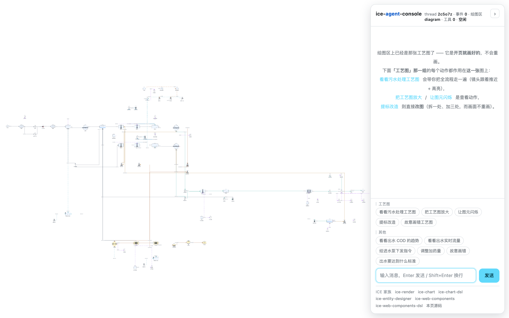
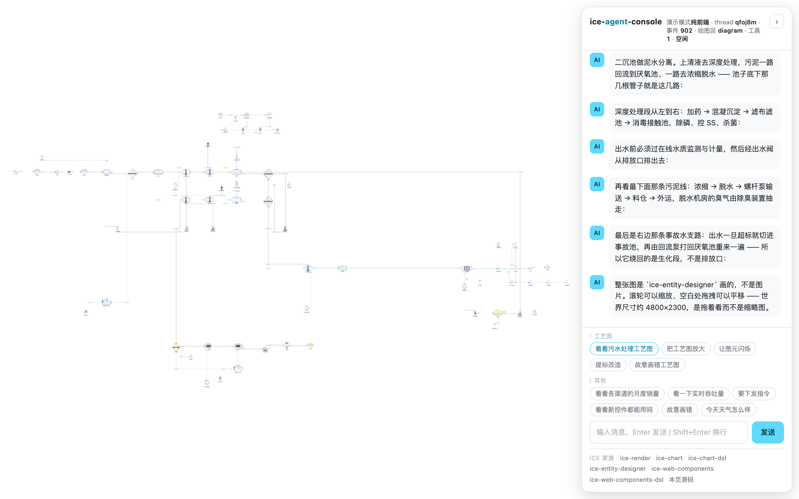
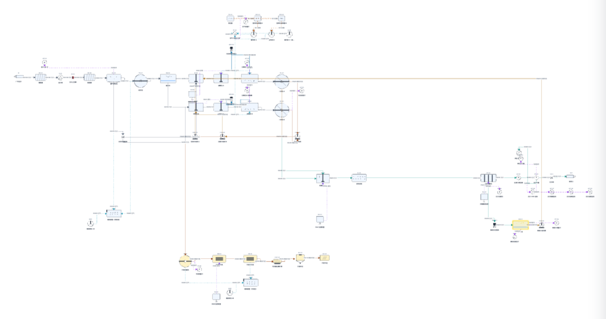
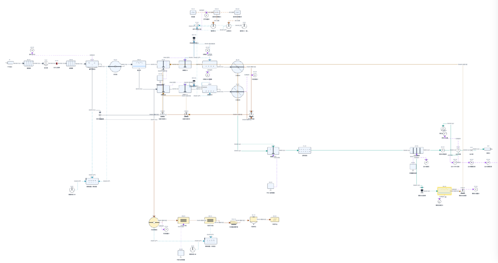
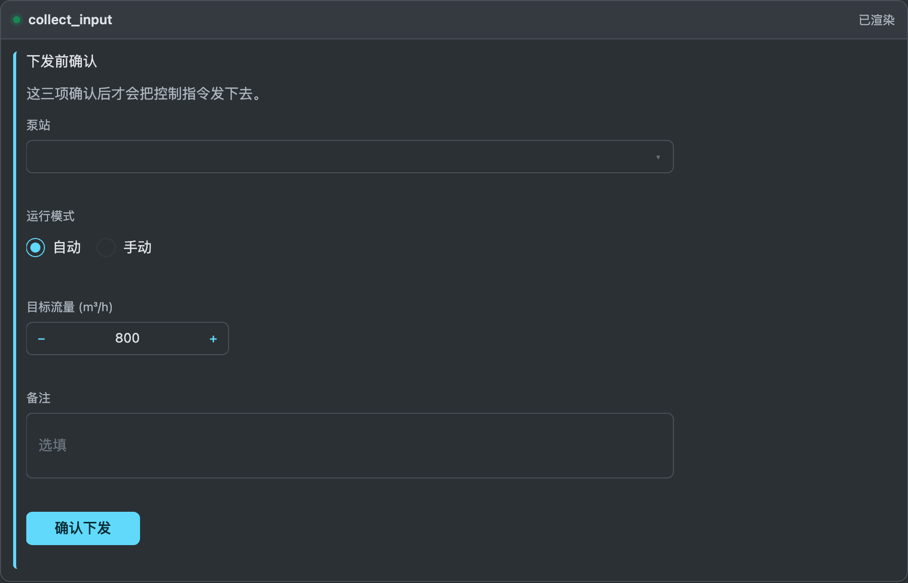
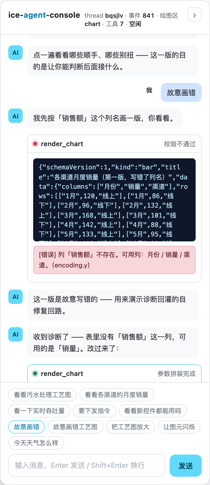
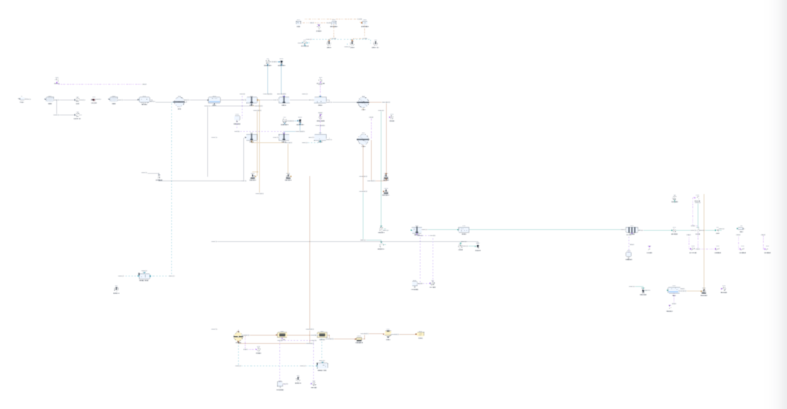
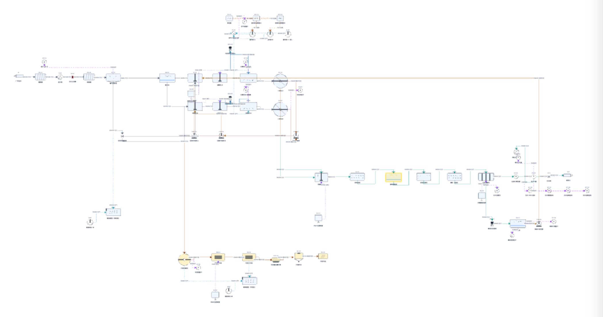

# ice-agent-console

把 **ICE 家族**接到 **AG-UI 协议**上：Agent 的事件流驱动 ICE 画布。

**绘图区是整页的主体**，开页就画着那张污水处理工艺图；对话是**浮在它右边缘上**的一块面板。
切换界面 = 在绘图区里**换图层**，不是往消息流里插卡片。



一个最小可运行实例，**两种模式、一个接口**：

| 模式 | 什么时候用 | 后端是什么 |
|---|---|---|
| **剧本模式**（默认） | 不配任何东西就能跑。演示、录屏、e2e | `ScriptedAgent` —— 确定性的规则 agent |
| **模型模式** | 配上 token 之后 | `LlmAgent` —— 真模型决定画什么、问什么 |

两种模式产出的都是**同一串 AG-UI 事件**，所以传输层、前端归约器、渲染层完全分辨不出来，
也不需要分辨。换模型只动一个文件（`server/agents/llm.ts`）。

"谁产生事件"之外还有**独立的一维**："事件怎么送到页面"。它也有两种，见 §1.0：

| 传输 | 什么时候用 | 需要进程 |
|---|---|---|
| **连后端**（默认） | 本地开发、接真模型、e2e | 前端 + `node:http` 的 AG-UI endpoint |
| **纯前端** | **静态托管**（GitHub Pages 之类）：把同一份剧本搬进浏览器 | 只有一个静态目录 |

两维互不相干（模型模式也能跑在纯前端里，只要把那份 agent 打进包），但默认只组合出
"剧本 + 连后端"与"剧本 + 纯前端"——这两种覆盖了"本地开发"与"发一个演示站点"。

```
┌──────────────────────────────┐                ┌──────────────────────┐
│  浏览器                       │  POST /agui    │  AG-UI endpoint      │
│                              │  (RunAgentInput)│  (node:http)        │
│  ┌────────────────────────┐  │ ──────────────►│                      │
│  │ #stage  绘图区（铺满）   │  │                │  ScriptedAgent /     │
│  │   ↑ ICE 在这里画         │  │ ◄── SSE 事件流 ─│  LlmAgent            │
│  └────────────────────────┘  │                └──────────────────────┘
│  ┌──────────┐                │                        ↑ OpenAI 兼容接口（可选）
│  │ #chat    │ 浮在右边缘      │
│  │ 对话面板  │ （真 DOM）      │
│  └──────────┘                │
└──────────────────────────────┘
```

---

## 1. 快速开始

前置：**五个**兄弟仓库要先构建过（工程不装它们的 npm 包，直接指向同级目录：
运行时靠 webpack `resolve.alias`、类型靠 tsconfig `paths`、测试靠 jest `moduleNameMapper`）。

```bash
# 在 ice-render/ 目录下
ls ice-render/dist/index.cjs ice-chart/dist/index.cjs ice-chart-dsl/dist/index.cjs \
   ice-web-components/dist/index.cjs ice-web-components-dsl/dist/index.cjs \
   ice-entity-designer/dist/index.cjs   # 都应在（工艺图用 ice-entity-designer）

cd ice-agent-console
npm install
npm run dev          # 同时起 AG-UI 后端(8099) 和前端 dev server(8100)
```

打开 http://localhost:8100 。**不配任何东西**就能用 —— 这时走的是内置剧本。
（本地开发**不会**自动开演；想直接看那个效果加 `?autoplay=1`，见 §1.0。）

下面那排快捷按钮各对应一条回路。它们**按"作用对象"分成两组** ——
**「工艺图」那一组排在最前**（那张图是整页主体，大多数动作都作用在它上面），
「其他」那一组是"切界面 / 走别的回路"：

| 按钮 | 演示什么 | 截图 |
|---|---|---|
| **看看污水处理工艺图** | 把工艺图**切回**绘图区。它开页就在，这一条只是又"显示"了一次 —— **不重画** | [工艺图](docs/images/water-process.png) |
| **把工艺图放大** | **AI 下命令缩放视图**：相对叠加（放大→再放大→缩小→复位），平滑补间 | — |
| **让图元闪烁** | **AI 下命令图元闪烁**：`point_at` 带 `blink`，依次点出三个池子并各闪几下 | [识别高亮](docs/images/highlight.png) |
| **提标改造** | **改图**：`STATE_DELTA` + JSON Patch 拆掉初沉池、加三个提标单元 —— **图层不重建** | [提标改造](docs/images/upgrade.png) |
| 故意画错工艺图 | 同一条自修复回路，但**吐回同一种图层**：图 DSL 写错 → 修出来的还是图 | — |
| 看看各渠道的月度销量 | 主链路：文字流式 → 参数流式拼装 → 绘图区切到图表 → **指着 3 月讲** | [图表](docs/images/chart.png) |
| 看一下实时吞吐量 | `STATE_DELTA` → `appendData` 快路径，同一张图逐拍长数据 | [流式追加](docs/images/streaming.png) |
| 要下发指令 | **人机回环**：中断 → 绘图区切成表单 → 填完提交 → 带 `resume` 开新 run | [表单卡](docs/images/form-card.png) |
| 看看新控件都能用吗 | **控件原型页**：一张表单里放 10 个字段，覆盖 DSL 0.3.0 的 20 个字段类型 | [新控件](docs/images/showcase.png) |
| 故意画错 | **自修复回路**：坏 DSL → 诊断回灌 → agent 自动吐修正版 | [自修复](docs/images/self-repair.png) |
| 今天天气怎么样 | 兜底：不画图，只回文字（**绘图区保持原样**，不是清空） | — |

（分组顺序即界面上的顺序，`src/entries/boot.ts` 里 `AgentConsolePage.CHIP_GROUPS` 是它的出处。）

**也可以在图上直接操作**：

- 点柱子、或框选一段区间 → 触发新一轮 run，你的操作作为结构化上下文上报
- 绘图区**底部那条控件栏**（`ice-web-components` 画在另一张画布上）：
  「解释这张图」/「换个画法」/「看实时数据」 —— 同样走 AG-UI 上行
- 工艺图上滚轮缩放、空白处拖拽平移（那是"看图"的手段，不改数据）
- 面板右上角 **›** 收起对话 → 绘图区立刻占满整个视口

```bash
npm run serve        # 只跑静态产物（仍需后端在跑）
```

### 1.0 演示模式：**不需要后端**（纯静态托管）

上面那套要两个进程（前端 8100 + 后端 8099）。但"演示给别人看"这件事不该要求对方跑起后端，
所以有一条**纯前端**的路：

```bash
npm run build:demo                    # 产物默认走演示模式
npx http-server dist -p 8200 -c-1     # 只是起个静态服务器，没有后端
```

打开 http://localhost:8200 —— **后端没起也照样能用**。画面与连后端时**一模一样**，
区别只有顶栏那一行徽标：



注意截图右上角的 **`演示模式` `纯前端`** —— 这张图就是在**没有任何后端进程**的情况下拍的，
而它跑了完整的 14 拍讲解（901 个事件、14 次 `point_at` / `zoom`）。

> 这不是"看起来一样"：拍照脚本另起了一个干净页面、断言 `runMode() === 'demo'`，
> 并**全程盯着有没有请求打到 8099**（结果 0 个）。截图只能证明画面，这两条才是证据。

#### 开页自动开演（`?autoplay=`）

演示站点是"发出去给人看"的东西，而**第一印象只能给一次**：开页停在一张静止的工艺图上，
看图的人默认它是一张图片 —— 得有谁先告诉他"下面那排按钮可以点"，他才会去点。
所以演示产物**默认自己演一遍**：开页 0.7 秒后自动按下「工艺图」那组的第一个按钮，
镜头拉开 → 按工艺段推近 → 一路高亮（约 19 秒）。

| 来源 | 怎么表达 | 默认 |
|---|---|---|
| 构建期默认 | 演示构建（`npm run build:demo`） | **开** |
| 运行期覆盖 | `?autoplay=1` / `?autoplay=0` | 盖过默认 |

普通 `npm run build` 的默认是**关**，所以本地开发与 e2e 的行为与加这个开关之前一致
（`npm run dev` 每次刷新都自动演 19 秒、面板多一屏消息，调试时会很烦）。

**`?demo=` 与 `?autoplay=` 是两个独立的轴** —— 前者管"事件从哪儿来"，后者管"开页要不要自己动"，
所以四种组合都是合法的：

```
?demo=1&autoplay=0   # 纯前端，但安静地等我点
?demo=0&autoplay=1   # 连后端，开页就自己演一遍
```

> 默认值上有一处**刻意的交叉**：构建期默认还要求"这次真的走着纯前端那条路"。
> 演示构建上若把 `?demo=0` 打开，后端多半没起 —— 自动演就会自动弹一张错误卡，
> 而第一印象不该是一张错误卡。显式写 `?autoplay=1` 时不受这条限制（用户点了名要看，那就演）。

**最重要的一个设计决定：用户一动手就让位。** `send()` 有 `if (running) return` 的护栏，
不主动取消的话，开页那 19 秒里点按钮 / 打字会被**静默吞掉** ——
页面看着能点其实没反应，比不自动开演还糟。所以任何"不是自动开演"的 `send` 进来时，
先 abort 掉它并**等那一轮真的停下来**（取消是异步的，不 await 的话紧接着的用户那一轮
还是会被护栏吞掉）。被掐掉那半截消息**保留着** —— 它是真发生过的事，抹掉反而看不懂。

`?autoplay=0` 在什么地方有用：分享"我想让你自己点着看"的链接、录屏、
以及**拍截图**（`scripts/shoot-docs.cjs` 每张都带 `?autoplay=0`，
否则 `hero` 那一张会拍到"讲到一半"的画面）。

#### 发到 GitHub Pages

本仓的演示站点在 **https://ice-render.github.io/ice-agent-console/** —— 它就是下面这条命令的产物。

```bash
npm run deploy:pages            # 构建演示产物 → 自检 → 推 origin-github 的 gh-pages
npm run deploy:pages -- --dry   # 只构建 + 自检，停在本地（先看看产物有没有问题）
```

`dist/` 是自包含的静态目录（一个 `index.html` + 一个 JS + TDK 那几个静态文件，见 §12），**用相对路径**，
所以子路径部署（`https://<你>.github.io/<仓库>/`）直接用 —— 不需要设 `publicPath`。
演示站点是**构建产物**，所以既不需要 `gh-pages` 这个 npm 包，也不需要 Actions。

这个脚本存在的原因是那几步里有**四个做错了不报错**的地方（`scripts/deploy-pages.mjs` 里逐条写了）：

1. **必须是 `build:demo` 的产物。** 普通 `npm run build` 的产物默认连后端，
   推上去开页就找 8099、页面白屏。脚本会**读产物自证**再继续（见下面那条注）。
2. **`.nojekyll` 不能省。** GitHub Pages 默认拿 Jekyll 处理一遍，
   而 Jekyll **会忽略下划线开头的文件/目录**。当前产物没有这种文件，
   但这是零成本的保险 —— 哪天 asset 命名带上 `_`，就会**静默少一个文件**、页面白屏，
   而构建日志是绿的。
3. **推送必须 force。** `gh-pages` 每次装的是一整份新产物，旧历史没有意义
   （上一版的 `boot.<hash>.js` 留在分支上只是白占体积）。
4. **远端是 `origin-github`，不是 `origin`。** 本仓 `origin` 指向 gitee。

> **自检判据为什么不是"有没有 `__ICE_DEMO__` 残留"**：那是错的。
> `DefinePlugin` 在**两种**构建里都会把它替换掉（普通构建换成 `false`），
> 所以"无残留"对普通构建同样成立，等于没检；"演示模式"那串文案也留在源码里
> （一行永远走不到的三元分支）。第一版就是这么写的，实测拿普通构建的产物去喂它，
> 它照样说"通过"。**唯一的区别**是 `resolveRunMode` 那个默认参数编译成了 `!0` 还是 `!1` ——
> 现在按这个判，而且锚点找不到时**直接失败**而不是放过。

**还有一件脚本管不了的事**：仓库 **Settings → Pages** 里的 Source 必须是
**Deploy from a branch** / `gh-pages` / `/(root)`。如果它停在 **GitHub Actions**、
而仓库里又没有对应的 workflow，那么**一次构建都不会发生** —— 分支推上去了、
Pages 也配着，站点却一直 404，且没有任何报错。
（本仓第一次就是这个状态：`build_type: workflow` + 零个 workflow + 零次构建记录。
改成分支之后第一次构建 21 秒就过了。）

顺带一句：**这个仓库天生不适合 Actions 构建** —— 它要六个兄弟仓的 `dist/` 才能打包
（见 §8.1，家族包走 alias 指向同级目录，`node_modules` 里一个都没有），
CI 里得先把六个仓库全 clone + build 一遍。直接推产物比修那条流水线划算得多。

它也自包含到**单个 JS**，所以连 `file://` 双击打开都能跑
（代价见下面"为什么不用动态 `import()`"）。

#### 它不是"另一个 mock 实现"

演示模式在浏览器里跑的是**同一份** `server/agents/scripted.ts` ——
同一批剧本、同一套事件序列、同一个播放节奏、同一条自修复回路。
`src/domain/agui/local-agent.ts` 只做一件事：把它的 `AsyncIterable` 事件流喂给上层，
和远端那条 `fetch + SSE` 的路径**共用同一个签名**（`RunTransport`）。

所以这里**没有第二份 mock 要维护** —— 哪天 `scenarios.ts` 改了，演示站点跟着变。

代价说清楚：那份 agent 代码会**打进主包**（约 +2%），普通构建也背着它。
换来的是产物自包含（动态 `import()` 那条路会让 `file://` 打不开）。

#### 开关：构建期定默认，运行期可覆盖

| 来源 | 怎么表达 | 说明 |
|---|---|---|
| 构建期默认 | `npm run build:demo` | 产物默认走演示模式 |
| 运行期覆盖 | `?demo=0` / `?demo=1` | 同一份产物里临时切回去 |

普通 `npm run build` 的默认是**连后端**（与加这个开关之前完全一致）。
非法值（`?demo=whatever`）落回构建期默认，不报错 —— 分享链接手抖打错一个参数不该白屏。

演示模式下顶栏会显示 **演示模式纯前端**。这一条是刻意留的：它走的是内置剧本、
没有任何模型参与，不标出来的话第一次看到的人会以为"模型模式坏了"。

### 1.1 接自己的大模型

**只要接口兼容 OpenAI 的 `/chat/completions` 就行** —— 官方、DeepSeek、通义、本地的 ollama /
vLLM / LM Studio 都可以。填三行，重启：

```bash
cd ice-agent-console
cp .env.example .env
```

```ini
ICE_LLM_API_KEY=sk-你的token
ICE_LLM_BASE_URL=https://api.openai.com/v1     # 本地 ollama 是 http://localhost:11434/v1
ICE_LLM_MODEL=gpt-4o-mini
```

重启 `npm run dev`，看启动横幅：

```
[agui] agent     LlmAgent（真模型；节奏 26ms/字）
[config] 读到了 .env
[config] 模型   gpt-4o-mini
[config] 接口   https://api.openai.com/v1
[config] token  sk-a…mnop（56 位）
```

#### 全部配置项

| 变量 | 默认 | 说明 |
|---|---|---|
| `ICE_LLM_API_KEY` | 空 | **token**。留空就走剧本模式 |
| `ICE_LLM_BASE_URL` | `https://api.openai.com/v1` | **接口地址**，不含结尾斜杠（代码会拼 `/chat/completions`） |
| `ICE_LLM_MODEL` | `gpt-4o-mini` | 模型名。**要选支持 tool calling 的** —— 本工程靠工具调用决定画什么 |
| `ICE_LLM_TEMPERATURE` | `0.3` | 采样温度。要它稳定挑工具就调低 |
| `ICE_LLM_TIMEOUT_MS` | `60000` | 单次请求超时。本地小模型首字慢就调大 |
| `ICE_LLM_MODE` | `auto` | `auto` 有 key 就用模型 / `scripted` 永远走剧本 / `llm` 必须走模型 |
| `ICE_AGENT_PACE` | `26` | 播放节奏（毫秒/字）。`0` = 不等，e2e 用 |
| `ICE_AGENT_API_PORT` | `8099` | 后端端口（家族端口表登记过，一般不用改） |

几个刻意的取舍：

- **也认 `OPENAI_API_KEY` / `OPENAI_BASE_URL` / `OPENAI_MODEL`** —— 你本机已经有的话不用再抄一份。
- **`process.env` 优先于 `.env`**：容器里注入的变量不会被仓库里的一份文件顶掉。
- **显式写了 `ICE_LLM_MODE=llm` 却没给 token → 启动直接报错**，不会静默退回剧本。
  静默退回会让你以为配好了、实际一直在看假的。同理，**接口报错（401 / 404 / 超时）会原样抛到界面上**
  变成一条红色气泡，里面是接口的真实报错，不降级。
- **token 在日志里只打前后各 4 位** —— 启动日志经常被贴到 issue 里。
- `.env` 已进 `.gitignore`，只有 `.env.example` 进版本库。

#### 配完先跑自检

配大模型最容易卡住的不是代码，是那三行配置：token 打错一位、地址少了 `/v1`、
模型名不存在、接口不支持 tool calling……这些在界面上看起来都只是"没反应"。所以有一条命令：

```bash
npm run llm:check
```

```
ice-agent-console · 大模型配置自检

  接口   https://api.openai.com/v1
  模型   gpt-4o-mini
  token  sk-a…mnop（56 位）

✓ 接口通了，模型回了："收到"
✓ 模型会调工具：render_chart，参数解析成功
✓ 认得出图表类型：kind = bar

✓ 配置可用。跑 npm run dev，然后把刚才那句问一遍试试。
```

它会打两次请求：一次最小的（验连通性 / token / 模型名），一次**带工具的**
（验这个模型会不会用 tool calling —— 这一条是本工程能不能用的关键，
而很多接口的报错信息在这件事上很含糊）。失败时会把错误翻译成能直接动手改的一句话。

### 1.2 模型模式下它会怎么做

工具一共五个，都在 `server/agents/tools.ts`：

| 工具 | 干什么 |
|---|---|
| `render_chart` | 把数据画成图表，切到 chart 图层（`ice-chart`） |
| `render_diagram` | 把**图**切到 diagram 图层：kind-first 的图 DSL，目前一种 kind = `water-process`（给排水工艺流程图，`ice-entity-designer`） |
| `collect_input` | **渲染成可填的表单，并让这一轮停下来等提交** —— 在协议里这就是一次中断 |
| `point_at` | 画完之后指着某个地方讲（图表：`xValue` 是 x 刻度；工艺图：`xValue` 是单元 id 或位号，如 `ana` / `AE-101`），可带 `blink` |
| `zoom_view` | 缩放视图（工艺图专用）：`direction: 'in' \| 'out' \| 'reset'` |

一次 run 里**调两次模型**：第一次让它选工具；把工具结果回灌之后再调第二次，拿"画完之后的那句话"
（第二次只带 `point_at` / `zoom_view` 这两个"图上动作"工具 —— 不许在讲的时候又画一张）。
这是为了对齐剧本里的节奏（`先说一句 → 切图层 → 再讲一句`），也是真实 agent 循环的形状。

> **工具 schema 故意写得不等穷尽。** 表单 DSL 的完整约束有 38 个错误码，
> 全塞进 schema 既贵又没用 —— 值语义（"默认值必须在 options 里"）本来就不是 JSON Schema 能表达的。
> 所以这里只写结构骨架，值语义交给下游：客户端的 `validateFormDsl` 校验，
> 不通过就把**带"可用取值"的结构化诊断**经 `context` 回灌，下一轮模型自己改。
> 那条自修复回路本来就在（§2.6），**剧本模式与模型模式共用它** ——
> 剧本是"故意写错"，模型是"真的写错"，回路的代码一行不差。

> **文本不是真 token 流。** 事件序列是一份纯函数（`dsl-to-events.ts` 的 `planToEvents`），
> 真流式意味着要再写一份"边收边发"的实现，两份必然漂。所以这里是拿到完整回复后
> 按节奏分片播 —— 观感上"它在逐字打"是一样的，区别只在开始打之前多等一次网络往返。

---

## 2. 它演示了什么

六条回路，都是这个工程存在的理由：


### 2.0 起点：一张真实的工艺图，而且它**就是页面本身**

**开页不需要跟 AI 说任何话**，绘图区上已经是**某 10 万 m³/d 市政污水厂的全流程**：
**两组并联的 AAO** + 混凝沉淀 + 滤布滤池 + 消毒，**68 个单元 / 81 段管线**。



上面这张裁到**图的着墨范围**（不然 1440×900 里有六成是白边）。下面这张是同一屏、
但**对话面板收起来**了 —— 1440 宽的绘图区**整幅**都是那张图，最能说明"图才是页面主体"：



把面板展开就是首屏那张 —— **图是主体，话浮在上面**。

它不是一张图片，也不是拿几个符号摆出来的示意图。判定"真实"的标准不是"看着热闹"，
而是**图上可判定的工艺约束**：

| 事实 | 值 |
|---|---|
| 单元 / 管线 | 68 / 81 |
| 用到的符号种类 | **31 / 31**（`ice-entity-designer` 的全部给排水记号） |
| 用到的介质 | **9 / 9**（污水 / 出水 / 回流污泥 / 混合液回流 / 剩余污泥 / 空气 / 药剂 / 信号 / 动力） |
| 两组并联生化线 | A / B 两组各一套 AAO + 二沉池，由**配水井**分水（真实厂几乎都是多组并联） |
| 配套系统 | 鼓风机房（3 台 + 变频器 + 变压器）、加药间（PAC / PAM / 次氯酸钠 / 碳源四个投加点）、污泥线（浓缩 → 脱水 → 干化 → 料仓 → 外运）、两套除臭、再生水回用、事故水支路 |
| 在线仪表 | 进 pH / 两组溶解氧 / 污泥浓度 / 出水浊度 + **出水四项（COD / 氨氮 / 总磷 / 总氮）** —— 排污许可要求联网上传 |
| 引擎的工艺校验 | `validateWater()` **零问题**（位号唯一、无孤立单元、管线都有介质与管径、出水路径有在线监测、剩余污泥有出路、AAO 有内回流） |

选它当第一个例子的原因就是这个覆盖率：它把给排水工艺图这套记号系统**整个跑了一遍**，
而不是挑几个符号证明"能画"。

#### 为什么它是"页面本身"而不是一张卡片

界面曾经是反过来的：对话是主体，图作为一张卡片内联在消息流里。改成现在这样是因为
那个结构有两个硬伤：

1. **图在消息流里，所以每次都要重画一遍。** 每张卡片是一块新 canvas + 一个新 ICE 实例，
   68 个符号 + 81 段管线要重建一次 —— 而用户只是在跟 agent 继续聊。
2. **图和话是两条平行的流。** "把刚才那张图放大"没有"刚才那张图"可指，只能又画一张。

现在的四条规矩（就是这次改动要解决的）：

| 需求 | 落点 |
|---|---|
| 一开始就显示工艺图，占满整个页面 | boot 时 `stage.mount('render_diagram', …)`，`#stage` 是 `position:fixed; inset:0` |
| 消息流与对话框**浮在**页面上 | `#chat` 是 `position:fixed` 的浮层（可折叠，折叠后绘图区占满） |
| **不重画**，所有动作都作用在已经画好的图上 | 同一份 DSL 再挂一次 → **按内容比对**，只重新显示，一个符号都不重建 |
| 切别的界面也在同一块绘图区里切 | 绘图区里**换图层**（`diagram` / `chart` / `form`），不是往消息流里插卡片 |

"不重画"这件事在 e2e 里是**可断言**的：`stageInfo().builds` 记着每种图层建过几次 ——
切到图表再切回工艺图，`builds.diagram` 必须还是 `1`。

#### 这张图能做的三件事

也正好是 ICE 家族三层能力的叠加：

1. **画** —— `ice-entity-designer` 的 `WaterProcessDesigner`，由一份
   **kind-first 图 DSL** 驱动（`{ kind: 'water-process', units, pipes }`）。
2. **看** —— 图的世界尺寸约 **8435×4080**（单元原点跨度；算上符号自身的宽高是 8510×4199），
   而可视区只有 ~1050 宽，所以它是**可缩放平移的视口**，不是缩略图。
   两种取景刻意分开：
   - 初始视野按 DSL 里 `viewport.focus` 指定的主流程链适配（约 0.12 倍）—— **近景**，
     只看水线主线，污泥线 / 事故水 / 加药间本来就该在框外（"排除它们"正是 focus 存在的理由）；
   - 「看整张图纸」用 `fitAll()` 按**全部图元**的包围盒适配（约 0.12 倍）—— **全景**。
     讲稿里"先把整张图框进来"那一档走的是同一条路（`ice/zoom` 的 `direction: 'fit'`），
     见 §2.0.1。

   两个倍率数值接近、语义完全不同，所以**别互相替代** —— 拿一个手算常数去当"全景"，
   会随窗口宽度、面板遮盖与图元尺寸漂掉（实测的后果见 §2.0.1）。

   ⚠️ **这两个倍率是"图的世界尺寸"的函数**，图上没有"正常的倍率"这回事：
   把图元间距整体放开之后（见 §2.0.2），同样的取景只剩 0.12 倍了。
   任何"绑在绝对倍率或绝对着墨像素上"的判据都会因此过期 ——
   e2e 里那条"开页有图"的着墨判据就是这么红的（原来写 `> 20000`，
   放开间距后掉到 12439）；现在改成**覆盖率**（着墨 ÷ 可视区面积），与尺度无关。
3. **讲** —— agent 讲解时能把某个单元**移到视野中央并高亮**（`point_at`），
   与图表的「指着讲」走同一条通道（`ice/point-at` 自定义事件）。

#### 2.0.1 "全景"档为什么是 `fit` 而不是一个倍率

这条是实测踩出来的，值得单独说 —— 它演示了"看起来对"和"真的对"差多远。

原先讲稿的"全貌"档写的是 `{ direction: 'to', scale: 0.22 }`：一个照着
"4820 宽的世界 ÷ 可视区 1048"手算出来的常数。它有两个问题：

| 问题 | 后果 |
|---|---|
| **倍数算不准** | 恰好装得下的倍率取决于可视区宽度（窗口尺寸 − 面板遮盖）、图元自身尺寸、留白。手算的余量被这些吃掉之后 0.22 实际略微超宽 |
| **`to` 不重新取景，只改倍率** | `to` 的平移锚点是"保住当前可视区中心那个世界点"（这样"先 `pointAt` 把目标移到中心、再 `to` 放大"才能把目标留在原地）。于是它**继承**了上一个镜头的位置 —— 从生化段特写推远到"全貌"时，图纸中心并不在屏幕中心上 |

实测结果：**左侧 1870 世界像素（整个预处理段加半个生化段）被推出屏幕左边界**。
画面看起来只是个"远景"，不报错，也几乎看不出来 —— 除非把**全部图元的世界包围盒**
投影到屏幕上，量四个方向有没有溢出。

修法不是调那个常数，而是换掉语义：给 `ice/zoom` 加了 `direction: 'fit'`，
倍率与平移**一起**由内容包围盒算出来，与界面上「看整张图纸」按钮**共用同一份计算**
（`DiagramLayer.__fitViewport()`）。现在讲稿那一档与 `fitAll()` 的倍率**完全相同**
（差 < 1e-16），四个方向都留出余量。

> 这个 bug 还在链路上暴露了第二个坑：`fit` 是新方向，而归约器的合法性判断是
> `in || out || reset || (to && 合法 scale)` —— `fit` 一条都不满足，被当"非法方向"
> **静默丢掉**。协议里合法、视图层也实现了，命令却根本到不了视图层。
> 所以 e2e 断言的不是"有没有溢出"，而是**"讲稿的全景档倍率 == fitAll 的倍率"** ——
> 后者对"命令被丢掉"这件事灵敏得多（0.22 与 0.2059 差 6.8%，一眼就红）。

#### 2.0.2 图元之间**不许压住** —— 这件事也是可断言的

"图看着挤不挤"原先只能靠人眼扫一遍。而人眼看不出 1px 的贴边（实测有 4 处只差 1~11px），
更看不出"挪好了这一对、挤坏了另一对"。现在它是**纯函数 + 单测**。

难点在于**"占多大"要按落墨盒算，不能按引擎的 `getMinBoundingBox()`**：

```
          ┌─ 位号：顶边外侧居中，文字盒 top = -18
      ┌───────┐
      │ 符号   │      ← 形状盒（预设 w × h）
      └───────┘
          └─ 名称：底边外侧居中，文字盒 top = h + 14
```

位号与名称是**子节点**，`getMinBoundingBox()` **不算子节点**；而且它们刻意画在盒子**外面**，
文字盒宽度是 `max(w + 24, 90)` —— **对窄符号这条最要紧**：一个 32 宽的阀门，
它的文字盒有 **90 宽**，左右各溢出 29px。

> ⚠️ 我第一版就是拿 `getMinBoundingBox()` 量的，得出"**0 处重叠**"，
> 而肉眼看得很清楚有几处压在一起。这个教训值得记：
> **量错了会给出"没问题"的结论，比量不出来更危险。**

判据在 `src/domain/diagram/layout.ts`（纯函数），用例在 `tests/diagram-layout.test.ts`：
**零重叠** + **两两间隙 ≥ 20px** + **每单元摊到的世界面积有下限**，基础图与提标后的图各判一遍。

顺带把它做成了"可迭代"：`scripts/layout-model.mjs` 是同一套模型的离线版，
`scripts/layout-sandbox.mjs` 用来试缩放系数 —— 调坐标从"反复开浏览器"变成秒级。

**这次实际改了什么**：整体放大到 **1.75 倍**（落墨范围 4895×2449 → 8510×4199，
每单元摊到的面积 ×2.98），另有 4 处是**结构性**的、放大救不了，按最终坐标摆：

| 单元 | 原来 | 现在 | 为什么 |
|---|---|---|---|
| `carbonDosing` | (1530,200) | (2110,260) | 夹在 ana1 与 ana2 之间，那一列只剩 2px |
| `recycleValve2` | (1870,240) | (2710,290) | 贴在 anx2 的标签带下面 |
| `reclaimedPump` / `outletFlowMeterB` | (4280,700) / (4300,750) | (6205,1015) / (6420,1015) | **这两个叠在同一点上** |

后一对还带出一个**早先就有的错**：`pipe-meter-reclaimedPump` 从计量表的**下边**出来、
而泵在表的**上方** —— 那根线会绕一圈再回去，并且穿过表体。端口改成 `T → B`。

> 还有一类**应用层解决不了**的：管线标注（`DN700 污水` 这种）被引擎钉死在折线**顶点**上，
> 没有偏移入口。而顶点是路由器为了避开符号折出来的 —— 所以"标注压住符号位号"
> 对图元间距是**尺度不变**的（实测放大到 2.2 倍，数量一动不动：43~45）。
> 记在 `docs/upstream-gaps.md` 第 16 条，本仓只能改数据挪走个别冲突。

#### 这张图会**变**：动态增删图元

除了缩放与高亮，agent 还能**改图的结构** —— 见 §2.7「提标改造」。

还有一处与"搬图"有关的细节：不写管线端口时的兜底在 `src/domain/diagram/compile.ts`，
是 `R → L`（从左往右）而**不是**引擎默认的 `B → T`。
但这一版**81 段管线全部写明了端口** —— 图铺得开、有并联、有大量上下走线，
没有一处能靠兜底"恰好"走对。`tests/diagram-dsl.test.ts` 仍有一条专门钉兜底行为的回归。

#### agent 能在图上下的三种命令

除了"把图画出来"，agent 还能对**已经画出来的图**下达指令 —— 它们作用在**同一块**绘图区上，
不新建图层、不改数据。三条都走同一条通道（`CUSTOM` 事件），而不是 tool call ——
归约器里写明了判据：

> 不走 tool call：它不是一次工具执行，没有参数、没有结果。
> 不走 state：它是瞬时的演示动作，不是需要恢复的状态。

| 命令 | 做什么 | 事件 |
|---|---|---|
| **指着讲** | 把某个单元**移到视野中央并高亮** | `ice/point-at`（`{ value }`） |
| **高亮闪烁** | 在指着讲之上再**闪几下**（引注意） | 同一事件带 `blink: true` —— 不是另开一个工具，"定位 + 强调"本来就是一次动作 |
| **缩放视图** | `in` 放大 / `out` 缩小 / `reset` 回到初始视野 / `to` 绝对倍率 / `fit` 整图适配 | `ice/zoom`（`{ direction, factor?, steps?, scale? }`） |

五个方向里前三个与"人/模型的手势"对应，后两个是给**讲稿**用的（`to` 幂等、`fit` 按包围盒算，
见 §2.0.1）。协议里模型**只能下前三个** —— 模型不知道当前倍率，让它给绝对值就是在猜
（`server/agents/llm.ts` 的 `readZoomCommand` 显式只认这三个，多的一律当没给）。

两处设计取舍值得说明：

- **给人和模型的是相对的，不是绝对倍率**。agent 并不知道当前倍率，给 `scale: 1.5`
  这种绝对值很容易一跳跳到底、或者看不出变化。`reset` 也不回到 1 倍，而是回到**初始视野**
  （按 DSL 的 `viewport.focus` 适配的那一屏）—— 对一张 4820 宽的世界坐标图，
  1 倍意味着"看不清全貌"，不是用户要的"复位"。
- **闪烁用引擎原生的声明式动画**（`direction: 'alternate'` + `iterationCount`），
  不是应用层手写的逐帧补间。轮数必须是**偶数**：交替方向下奇数轮会停在最暗处，
  闪烁结束后高亮框一直是半透明的。`e2e/diagram.spec.ts` 有一条钉住"讲完停在全亮"。

### 2.1 单向：事件流驱动画布

`TOOL_CALL_ARGS` 是**分片流式**的，所以在对话里那条工具条目上能看到图表 DSL 一个字一个字拼出来 ——
而不是像多数工具调用界面那样只能转个圈。拼完 → `validateChartDsl` → `compileChartDsl`
→ 切到 chart 图层。

### 2.2 单向：Agent 指着图讲

`showHoverAtValue(x)` 让 Agent 能在解说过程中把高亮点移到某处。
事件流是**有序**的，所以文字 delta 和画布指令在时间上交错到达——
用户读到哪里，图就指到哪里。这是 ICE 在这条链路上最不可替代的能力。

### 2.3 双向：用户在图上的操作回到 agent

三个来源，走**同一条** `context` 通道：

| 来源 | 事件 | 来自哪块画布 |
|---|---|---|
| 点数据点 | `item:click` | 图表层 |
| 框选区间 | `brush:end` | 图表层 |
| 点控件按钮 | 控件自己的 `click` | **控件层（第二块画布）** |

它们都作为**结构化上下文**塞进下一轮 run 的 `context` 字段，而不是拼进用户说的话里。
分开的意义：agent 分得清哪部分是"用户做的"、哪部分是"用户说的"。

接上模型之后，提示词里可以给"用户动作"一个明确的地位。

### 2.4 双向：`state` 让 agent 知道"现在画面上是什么"

`context` 只能告诉 agent **用户做了什么**；要让 agent 知道**现在画面上是什么**，
得靠协议的 `state` 字段 —— 客户端把当前的图表定义放在 `state.chart` 里回传。

控件条上的「解释这张图」和「换个画法」就是读它：
前者逐项说出当前图表的类型/列/编码，后者**只换 `kind`、数据一行不动**重新画一张。
agent 不需要你复述"刚才画的是什么"。

### 2.5 双向：人机回环（中断 → 填表 → resume）

Agent 缺参数时**不是反问一句**，而是走协议的中断：

```
RUN_FINISHED { outcome: { type: 'interrupt', interrupts: [{ id, reason, message }] } }
```

前端据此进入 `waiting`（不是 `idle` —— 用户还没答），并把 `collect_input` 那次 tool call
的产物画成**表单图层**（浮在绘图区中央）。用户填完点提交：

```
新一轮 run 的 RunAgentInput.resume = [{ interruptId, status: 'resolved', payload: values }]
```

要点（这几条不是自定的，是从 `@ag-ui/core` 的 schema 问出来的）：

| 协议事实 | 含义 |
|---|---|
| 中断**也是** `RUN_FINISHED` | "run 结束了"与"还留着一个待答复的口子"不矛盾 |
| `interrupt` 形状 `{ id, reason, message? }` | `id` / `reason` 必填，数组非空 |
| 恢复 = **开新 run** + `resume` | 不是"接着跑"，所以前端要带上答案重发 |
| `status: 'resolved' \| 'cancelled'` | 只有两个取值 |

表单本身由 `ice-web-components-dsl` 渲染 —— agent 只声明"要问什么"：



**这是目前唯一一处"Agent 不只是说话，而是要用户做一件事"的能力。**
接上模型之后它同样成立：模型调 `collect_input` 就等于宣告"我需要用户提供信息"。

### 2.6 双向：诊断回灌的自修复

`ice-chart-dsl` 的 `validateChartDsl` **任何输入都不抛异常**，它的设计目的就是
"给 agent 做自修复用的反馈通道"——诊断里带可用列名、表达式字符位置。

这条回路把它用起来：坏 DSL → 客户端校验拦下 → 诊断走 `context` 回灌 →
agent 吐修正版 → 画出来。**全程自动，用户不用再说话。**



脚本化阶段就把这条回路走通，意义在于接真模型时回路上的每一段都已经测过了。
那时候唯一的变量只剩"模型这次吐的对不对"——而这个定位能力在 LLM 应用里最值钱，
因为平时你分不清是模型的问题还是管道的问题。**所以模型模式直接复用了同一条回路。**

### 2.7 双向：**改图** —— 动态增删图元

前面几条都只在**已有的图**上动镜头或高亮，图元本身一个没变。这一条改的是图的**结构**：

> **提标改造** —— 拆掉初沉池（AAO 前不设初沉池可以让更多碳源进生化段），
> 再上一段 **臭氧 → 活性炭 → 超滤**，并把原来 `filter → disinfect` 的直连管线换成绕经它们四条。

改之前 / 改之后（两张都是**同一块画布、同一个 ICE 实例**，中间没有重建也没有换视口）：

| 改造前 | 改造后 |
|---|---|
|  |  |

对着看那两处差别：**左边偏上那个「初沉池」没了**（连它的三根管线一起），
**深度处理那一条线上多出了三个池子**（臭氧 / 活性炭 / 膜池）。

**它走的不是"重画一张新图"**，而是 `STATE_DELTA` 里的**标准 JSON Patch**（下面是把真实载荷抄下来的）：

```jsonc
// 第一拍：拆初沉池 —— 连带删掉挂在它身上的三根管线、摘掉 focus 里的那一项，再补一根连通管
//         （拆一处、接一处；只把 units 那一项拿掉会留下悬空管线，见下面坑 ①）
{ "op": "remove", "path": "/diagram/pipes/62" },            // pipe-primary-deodor1
{ "op": "remove", "path": "/diagram/pipes/6" },             // pipe-primary-dist
{ "op": "remove", "path": "/diagram/pipes/5" },             // pipe-grit-primary
{ "op": "remove", "path": "/diagram/units/6" },             // primary
{ "op": "remove", "path": "/diagram/viewport/focus/6" },
{ "op": "add",    "path": "/diagram/pipes/-", "value": { "id": "pipe-grit-dist", … } },

// 第二拍：换掉被取代的那根直连管 + 加提标段三个单元与四根绕行管线
//         ⚠️ 这些下标是相对**第一拍之后**的文档算的，不是相对原始图（见下面坑 ②）
{ "op": "remove", "path": "/diagram/pipes/27" },            // pipe-filter-disinfect
{ "op": "add",    "path": "/diagram/units/-", "value": { "id": "ozone", … } },
{ "op": "add",    "path": "/diagram/units/-", "value": { "id": "carbon", … } },
{ "op": "add",    "path": "/diagram/units/-", "value": { "id": "membrane", … } },
{ "op": "add",    "path": "/diagram/pipes/-", "value": { "id": "pipe-filter-ozone", … } },
{ "op": "add",    "path": "/diagram/pipes/-", "value": { "id": "pipe-ozone-carbon", … } },
{ "op": "add",    "path": "/diagram/pipes/-", "value": { "id": "pipe-carbon-membrane", … } },
{ "op": "add",    "path": "/diagram/pipes/-", "value": { "id": "pipe-membrane-disinfect", … } }
```

净效果（模型层可断言）：符号 **68 → 70**（−1 +3）、管线 **81 → 82**（−3 +1 −1 +4），
图层重建次数保持 **1**、`validateWater()` 仍是 **零问题**、视口不重置。

**为什么用 JSON Patch 而不是自造一个"图元增删事件"**："state 变了"这件事协议里本来就有词
（`STATE_DELTA` + RFC 6902）。再发明一个通道只会多一条要维护、要测试、要跟模型解释的东西。

前端按**补丁的形状**分流（`src/domain/agui/state-patch.ts`，两个纯函数）：

| 补丁长什么样 | 走哪条路 | 代价 |
|---|---|---|
| 只往 `/chart/data/rows/-` 追加 | `appendData` 快路径 | 只加几个点，不重编坐标系 |
| 只增删 `/diagram/units` `/diagram/pipes` | **增量** `createSymbol` / `remove` | **图层不重建、视口不重置** |
| 其它（`replace` / 混合 / 下标越界…） | 全量重建 | 贵一点，但一定对 |

三条路都**不改协议、不改归约器形状** —— 归约器只是多吐一种 effect。

#### 两个坑，都在"文档"与"画面"的差别上

**① 渲染层的级联 ≠ 文档的一致性。**
`FlowDesigner.remove(unitId)` 会顺手删掉挂在它两端的连线，所以**画面**是干净的。
但 JSON Patch 只管把 `units` 数组里那一项拿掉 —— **管线数组原封不动**。
于是文档里留下"两端指向一个不存在的单元"的管线：本仓的守卫当场报错，
而任何一次"从 state 重建这张图"都会在建那几根管线时抛。
**所以补丁要表达完整意图**（删单元要连带列它的管线、还要把 `viewport.focus` 里的它摘掉），
别指望渲染层替文档收尾。

**② 下标会变，而 `remove` 一个存在的下标不报错。**
`STATE_DELTA` 是**顺序应用**的：第一拍删掉 3 根管线之后，第二拍的下标已经整体前移。
拿基准图的下标去编第二拍，会**静默删掉另一根管线**（图看着"变了"，但变错了）。
所以讲稿里用一个 `IndexCursor` 维护"id 列表"的镜像，每发一批就同步增删，
之后的下标都从它算 —— 同一批里还要**降序删**（否则 `splice` 会错位）。
这一条是实测踩出来的：单测里"最终图过校验"那条断言抓住了它。

---

## 3. 架构

### 3.1 三层

| 层 | 位置 | 职责 |
|---|---|---|
| 协议层 | `server/`、`src/domain/agui/` | AG-UI 事件的编解码、归约 |
| 翻译层 | `server/agents/dsl-to-events.ts`、`src/domain/ice/` | "想画什么" ↔ "事件序列" ↔ "ICE 调用" |
| 渲染层 | `src/view/` | 浮在画布上的对话面板（DOM） + 绘图区与它的三种图层（canvas） |

### 3.2 一个刻意的分界：DOM 管对话，canvas 管绘图区

`ice-web-components` 的立场是 "every pixel drawn by the engine"，但它适合的是
应用外壳、表单、弹窗这类自成一体的画布界面。**对话面板**不行：
消息要能选中复制、要能走输入法、要有浏览器原生的滚动惯性、要能被屏幕阅读器读。

所以分界线划在这儿，两半的宿主也是分开的：

| | 谁画 | 为什么 |
|---|---|---|
| `#chat`（消息、输入框、工具条目、滚动） | **真 DOM** | 需要选中、输入法、原生滚动、可访问性 |
| `#stage`（工艺图 / 图表 / 表单） | **canvas**（ICE） | 需要 ICE 的视口、命中测试、声明式动画、主题 |

这个工程不是纯 canvas 应用，这是有意为之。

#### 消息流的自动滚动是**有条件**的

新消息进来时面板要跟到底部 —— 但**一律滚到底**会让它没法往回读：你刚往上翻两屏
看前面那段解释，下一条流式文本就把你拽回底部（流式文本每秒来十几次，根本翻不上去）。

所以跟随的前提是"用户本来就在底部"：`scroll` 事件里量一次距底部的距离，
在容差内就继续跟随，用户一旦自己往上滚就**松手**，他滚回底部时再自己接上。
两个细节：

- **瞬时跳，不用 `behavior: 'smooth'`** —— 流式每秒调十几次，平滑动画每次都没跑完
  就被打断，结果是永远落在内容后面（看着像卡住）。
- 滚动必须放在**写完 DOM 之后**：`insertBefore` / `textContent` 会改变内容高度，
  提前滚就滚到了旧的 `scrollHeight`，一屏永远差一截。

#### 浮层必须自己挡住事件（一个很隐蔽的坑）

引擎在 `window` 上装了**全局**事件拦截器（`DOMEventInterceptor`），把所有指针 / 滚轮事件
**广播给每一个 ICE 实例**，唯一的过滤是"事件目标是不是另一块 **canvas**"。
对话面板是个 `<div>`，**不在过滤范围内** —— 不额外拦一道的话，在面板上滚一下，
工艺图那个实例照样会当成一次滚轮缩放（而且按自己的画布矩形算坐标）。

好在拦截器挂的是**冒泡阶段**，所以在面板根上 `stopPropagation()` 就能拦住
（`src/view/chat.ts` 的 `shieldFromCanvas`，在 `#chat` 上装一次 —— **整个面板**，
不只是消息区）。**别拦键盘** —— 输入框一直是这样工作的。

e2e 有一条正反两面的断言：面板上滚 → 视口不变；画布上滚 → 视口变。
少了后一半，一个"滚轮完全坏掉"的实现也能让前一半通过。

**"没拦住"长什么样，实测过一次**（2026-09-16，拿图表图层做的正反两面）：

| | 在**图表自己**上悬停（对照） | 在**面板**上悬停（实验） |
|---|---|---|
| 摘掉屏蔽 | 画面变（提示框 / 高亮） | **画面也变** ❌ |
| 装上屏蔽 | 画面变 | 画面一动不动 ✓ |

值得注意的是：**这条泄漏在工艺图上量不出来**。工艺图的滚轮缩放监听
是直接挂在 canvas 元素上的（`diagram-layer.ts`），目标是面板的事件根本到不了它 ——
所以"在面板上滚一下，图没动"**不能**用来判断这道屏蔽有没有用，它挡的是
**走引擎事件总线的那类交互（悬停 / 命中）**，而那几个图层正好是压在面板下面的。
这也是为什么那排家族链接放在面板**里面**：面板里加东西自动被覆盖，
加到面板**外面**的浮层要自己再拦一次。

#### 失败也要**画在对话流里**，不能只留在顶栏

`state.error` 一直都在（`RUN_ERROR` 时置位），但原先只被拼进顶栏那行 meta ——
于是失败时用户看到的是"**我发了一句话，然后什么都没发生**"：
面板里只有他自己那条消息，看上去像 AI 不理人。而顶栏那行字又小又挤，
得凑近了才能在 `工具 0 · 出错 · Failed to fetch` 里发现"出错"两个字。

实测路径就是本仓自己的演示站点：加上 `?demo=0`（于是走"连后端"那条 transport，
而静态站点上没有后端），点任意按钮就停在那个状态。

现在 `ChatView` 会在消息流末尾挂一张 `.error-notice`，三层信息各司其职：

| 层 | 内容 | 给谁看 |
|---|---|---|
| 标题 | 这一轮没能连上 agent | 一眼知道发生了什么 |
| 提示 | "…如果这是静态演示站点，用 `?demo=1` 改成纯前端" | **下一步动作**（最常见的失败就是开关被关了 / 分享了带 `?demo=0` 的链接） |
| 详情 | 原始报错（`Failed to fetch` / CORS） | 开发者查原因 —— 只给人话会让本地真配错的人无从下手 |

它是**状态**，不是 thread 里的一条消息，所以不进 `items`（e2e 有断言钉住）。
状态跟着 `error` 的值走：变了重画、空了移除 ——
`state.error` 在下一轮成功时不会自动清，所以以值比对为准。

e2e 那条**主动 `page.route('**/agui').abort()`** 造失败，而不是依赖"某个端口恰好没起"：
后者在本地与 CI 行为不一致，而且这个仓的 e2e 起后端是常态（§1.0 的注释里写了）。
反例也验过：把渲染那一行注掉重建，用例在 `toHaveCount(1)` 上失败。

### 3.3 绘图区按 tool 名切图层：一次 tool call 决定"显示什么"

**加一种图层仍然只是加一个工具名** —— 归约器与协议层一行都不用动：

| 工具名 | 图层 | 画布 | 生命周期 |
|---|---|---|---|
| `render_diagram` | `diagram` | 一块（`ice-entity-designer`）。**kind-first** 图 DSL，目前一种 kind = `water-process` | **boot 时建，永不销毁** |
| `render_chart` | `chart` | **两块**：图表（`ice-chart`）+ 控件条（`ice-web-components`），两个 ICE 实例 | 按需建，被顶掉即销毁 |
| `collect_input` | `form` | 一块（`ice-web-components-dsl`）。DSL 0.3.0 起支持 **20 个字段类型** | 按需建，被顶掉即销毁 |

**一次只有一层在显示**（图层之间是并排关系，不是叠加）。所以用不上
`linkViewport` / `setInputPassthrough` / `composeLayersToCanvas` —— 那些只在层与层重叠时有意义。

```
#stage  position:fixed; inset:0
├── .stage-layer[data-kind="diagram"]        ← boot 建，永不销毁
│     └── <canvas>   ICE 实例 ①，WaterProcessDesigner
├── .stage-layer[data-kind="chart"]          ← 按需
│     ├── .stage-chart  <canvas>   ICE 实例 ②（ice-chart 自己 new 的）
│     └── .stage-widget <canvas>   ICE 实例 ③（控件条，浮在绘图区底部）
└── .stage-layer[data-kind="form"]           ← 按需
      └── .stage-form   <canvas>   ICE 实例 ④（ice-web-components-dsl）
```

三种图层的**复用判据刻意不一样**，别统一：

| 图层 | 判据 | 为什么 |
|---|---|---|
| `diagram` | **按内容比对** —— DSL 序列化后相同就只 `show` | 这是"不用每次都重新绘制完整的工艺图"的落点 |
| `chart` | **复用宿主** —— 同一个 `ChartAdapter` 走 `setOption` 换数据 | 它在建实例那条路径上，重建会丢交互监听（见 §5.1） |
| `form` | **每次重建** | 表单 DSL 是一次性编译的，没有"改一张表单"这回事 |

#### 校验没过时**不切画面**

失败的那一轮**不提交**：绘图区保持原样（很可能还停在上一张好图上），
诊断只出现在对话里的那条工具条目上。
旧行为是"卡片亮着、画布空白"—— 那会让人以为图坏了，而实际上坏的是 DSL，agent 马上就会修。

#### 画布是"可视区"的子集

绘图区铺满视口，而对话面板**浮在它的右边缘上**压住一块。所以"画布尺寸"与"可视区"是两个数：

- 画布尺寸决定**渲染多少像素**（铺满，不透明）；
- 可视区决定**内容摆在哪、能动多大**（居中 / 适配 / 缩放锚点全按它算）。

不分的代价很直接：按整幅 1440 居中，图的正中间就落在面板底下，右边三分之一白白浪费。
`src/view/diagram-layer.ts` 的 `DiagramRegion` 就是这件事，`reframe()` 负责在"布局变了"时重摆视野
（而窗口只是重排时**不**重摆 —— 那会把用户拖到的位置冲掉）。

#### 为什么要两块画布而不是一块

**引擎的模型是「一层 = 一个 ICE 实例 + 一张 canvas」**，而 `ice-chart` 内部自己 `new ICE()`、
不接受外部实例（见 `docs/upstream-gaps.md` 第 7 条）。
硬塞只能走 `addMark`，但那个槽位是**按数据坐标**摆位的（适合"锚在异常点上的浮动按钮"），
不适合"绘图区底部一条控件栏"。两种需求，两个层。

分工的判据是"这东西该跟着数据坐标走，还是该跟着界面布局走"：

| 放哪 | 什么进这里 |
|---|---|
| 图表层（`addMark`） | 与数据绑定的东西：阈值线、异常点标记、锚在某个点上的小按钮 |
| 控件层（第二块画布） | 界面级的控件：一排动作按钮、图表类型切换 |
| DOM 面板 | 消息、输入框、滚动 —— 需要可访问性与输入法的东西 |

控件条用 canvas 画而不是 DOM `<button>`，代价要说清楚：**canvas 控件没有 DOM 的可访问性、
输入法、Cmd+F**。这里选它是因为要试的正是"canvas 控件层能不能跟图表共存"，
顺带拿到同一套主题。对话面板那部分仍然是真 DOM —— 分界线没变。

`src/domain/ice/layer.ts` 因此只有"尺寸转交 + 一起销毁"两件事，**故意没做成大抽象**。

### 3.4 纯核心 + 命令式外壳

`src/domain/agui/reducer.ts` 是**纯函数**，返回 `{state, effects}`：
它只描述"要做什么"，不碰 DOM。碰 canvas 的活在 `AgentConsolePage.applyEffects()`（`src/entries/boot.ts`）里 ——
它把 effect **打给 `StageView`**（effect 的形状没变，只是落点从"最后一张卡片"换成了
"绘图区当前那一层"）。

这样归约器可以被穷举测试（连"边画边指"的事件顺序都能断言），而 canvas 脏活留在需要它的地方。

#### 页面写法：一页 = 一个类

家族的应用层统一到「**一页 = 一个类**」（库侧是 `ice-web-components` 的 `ICEContainer` 契约，
`ice-smart-water` 的 12 个页面、各仓的示例页都这么写）。本工程只有一屏 ——
绘图区铺满视口、对话面板浮在右边缘 —— 所以**入口即页面**：`src/entries/boot.ts` 就是
`class AgentConsolePage`。

| 原来（模块级脚本） | 现在（页面类） |
|---|---|
| 顶层 `const stageEl = …` | `private readonly stageEl: HTMLElement` 字段 |
| 顶层 `let state = …` / `pendingDiagnostics` / `failedTool` | 同上，都是实例字段 |
| 顶层 `function send() {}` / `async function startAutoplay() {}` | `send()` / `startAutoplay()` 方法 |
| 顶层 `const CHIP_GROUPS = […]`（纯常量） | `private static readonly CHIP_GROUPS` |
| 模块顶层一路执行到底 | `constructor()` 按**原来的顺序**装配 + 文件末尾 `new AgentConsolePage()` |

三条细节值得知道：

- **构造期的顺序仍然是承重的**，搬家时一字未动：`installTheme()` 必须在造任何组件之前
  （本工程"启动即定死"的约定）、`syncPanelInset()` 必须在画工艺图之前
  （初始视野只设一次）、调试句柄挂完之后才轮到自动开演；
- **调试句柄是页面实例的成员**：`window.__iceAgentConsole` 里那一串查询全部走
  `this.stage` / `this.state`，它的生命周期就是这一页的生命周期（e2e 的 `helpers.ts` 直接读它）；
- **DOM 抓手走"局部变量 → 守卫里收窄 → 赋给 `readonly` 字段"**：所以方法里不必再写
  `this.metaEl!` 那种非空断言 —— 守卫已经把类型收窄成非空。

这条写法有棘轮：`tests/pageConvention.test.ts`（恰好一个类 / 无模块级 `function`、`let` /
文件末尾实例化 / 状态在实例上）。它跟 smart-water 那种"宿主 + 12 页"是两个形状：
那边入口是**宿主**（外壳 + 岛 + 切页，页面在 `src/view/pages/`），这里是单页应用，
入口就是那一页 —— 与 `ice-game` 的 `src/home/main.ts` 同类。

### 3.5 主题：画布与外壳读同一份 token

界面是**两半拼起来的**（§3.2），所以换主题要同时动两处 —— 而两处各维护一套颜色必然会漂。
试过一次那样：画布里的控件是 Bootstrap 深灰、外壳是另一套蓝，拼在一起像两个应用。

现在只有**一份 token 表**（`ice-web-components` 的 `ICEThemeTokens`），`src/domain/theme.ts` 负责分发：

| 谁 | 怎么拿到颜色 |
|---|---|
| 画布里的**控件** | `iceUIManager.setTheme()` —— 本工程在 boot 时定死（库 1.15 起支持热切换，见下） |
| 画布里的**引擎外壳**（选中框 / 手柄 / 阴影色） | `applyThemeToEngine(ice)` —— 引擎主题是**实例级**的，绘图区里那几块画布各调一次 |
| 画布里的**图表** | 不用单独调：`ICEChart` 的 `theme: 'auto'` 按**引擎主题背景色的亮度**判明暗 |
| 画布里的**图**（选中框 / 对齐引导线 / 插槽） | `ice-entity-designer` 的构造里会 `applyDesignerChrome(ice)`，它**从当前引擎主题派生**。所以图层的构造顺序是 **先 `applyThemeToIce` 再 `new WaterProcessDesigner`** —— 反了派生的就是引擎内置默认蓝，而不是家族品牌色 |
| **DOM 外壳** | `applyThemeToCss()` 把同一张表写进 CSS 变量，样式表里只引用 `var(--…)` |

**默认 light，暗色是 `?theme=dark`。** 暗色那条路是通的 —— 实测过 select 的下拉面板、
色板、分段控制器、穿梭框在深底上都能看。但库的暗色 token 是 Bootstrap 中性灰基调，
层与层之间明度差很小，面板 / 控件 / 浮层容易糊在一起、看着发闷；要好看得动库里的暗色 token，
那是另一件事（记在 `docs/upstream-gaps.md` 第 11 条，还附带一条实测到的具体缺陷）。

留 `?theme=dark` 这个查询参数是刻意的：**"暗色到底行不行"这件事要反复看才能真正判断**，
改一行代码再重启的成本高到不会有人去做；加个参数之后想再评估一次只是刷新一下。

两处细节：

- **强调色有两个名字。** 冰蓝 `#61D9FB` 在深底上当文字好看，在浅底上对比度不够（4.5:1 都不到）。
  所以拆成 `--ice`（填充 / 描边）与 `--ice-ink`（当文字，浅底取深一档的 `#0D7EA8`）——
  这是"暗色不是把亮色反过来"的一个具体例子。
- **token 表里没有的概念集中在一处。** 比如"半成品 DSL 的代码块配色"、"比面板沉一档的内凹面"、
  以及布局反转新加的**浮层三件套**（`--overlay-bg` / `--overlay-line` / `--overlay-shadow`）
  都不是主题 token。硬凑一个相近的 token 更糟（读的人会以为它是从主题来的），
  所以它们在 `theme.ts` 的 `LOCAL_TOKENS` 里显式按主题给出。
  浮层那三个是必需的：亮色主题的 `surface` 与 `elevated` 都是纯白，直接拿来当浮层底
  会跟绘图区糊在一起 —— 只能靠边框 + 阴影拉开，那两行就是那份差值。

**没做成运行时切换的开关**：本工程按"`?theme=dark` 启动即定死"设计，卡片是按需创建的，
画布上还跑着 rAF、事件监听与流式更新 —— 换主题要同时动 canvas 侧与 DOM 侧，收益不抵复杂度。

⚠️ 这条**不是库的限制**：`ice-web-components` 1.15 起组件样式槽里放的是**主题引用**
（`token('ui.colors.x')`，paint 时解析），`iceUIManager.setTheme()` 之后**不用重建组件树**
就会换色（库的 `docs/guides/theming.md` 第七节）。真要加开关，三句就够：
`setTheme()` + `applyThemeToCss()` + **逐块画布** `applyThemeToIce(ice)`（引擎主题是实例级的）。

---

## 4. 协议 → ICE 的映射表

**这张表是这个工程的全部价值**，剩下的都是管道。

| AG-UI 事件 | ICE 侧动作 | 备注 |
|---|---|---|
| `RUN_STARTED` / `RUN_FINISHED` / `RUN_ERROR` | 状态机 | |
| `TEXT_MESSAGE_*` | 纯 DOM 气泡 | 这层不需要 ICE |
| `TOOL_CALL_START/ARGS/END` | 对话条目：参数流式拼装 → 解析成 DSL → **切到对应图层** | `ARGS` 分片可见 |
| `TOOL_CALL_RESULT` | 条目进入终态 | |
| `STATE_SNAPSHOT` | `compileChartDsl` → `setOption`（**同一实例**） | 快照是替换语义 |
| `STATE_DELTA` | JSON Patch → 纯追加走 `appendData`，否则全量 `setOption` | 见 §5.2 |
| `CUSTOM: ice/point-at` | `showHoverAtValue(x)` | 指着讲 |
| 上行 `item:click` | → 新 run，`context` 带结构化交互 | 见 §2.3 |
| 上行 `brush:end` | → 新 run，`context` 带选区 | 同上 |
| 上行 控件按钮 click | → 新 run，`context` 带 `widget-action` | 来自**第二块画布** |
| 下行 **读** `RunAgentInput.state` | agent 据此知道当前图表是什么 | 见 §2.4 |
| `RUN_FINISHED` + `outcome.interrupt` | 状态进 `waiting`；绘图区切成**表单图层** | 见 §2.5 |
| 上行 `RunAgentInput.resume` | 用户提交表单 → 带答案开新 run | 协议原生通道 |

### 4.1 事件顺序：先画后讲

```
RUN_STARTED
[intro]              一句话说明要干什么
TOOL_CALL_START ─ ARGS×n ─ END     参数流式分片
TOOL_CALL_RESULT
STATE_SNAPSHOT                     画布真相
[beats]              画完之后的解说（可插 CUSTOM 指点 / STATE_DELTA 追加）
RUN_FINISHED
```

**为什么不是"边说边画"**：`CUSTOM` 指点的对象是画布，画布得先在。
第一版把解说全排在 tool call 前面，结果指点事件到达时图上什么都没有——
前端只能缓冲，而缓冲意味着"指着讲"和文字不再同步，整个演示效果就没了。
`tests/dsl-to-events.test.ts` 里有一条测试专门盯这个顺序。

---

## 5. 三处必须知道的 ICE 侧约束

### 5.1 不要用 `renderChartDsl`

它内部每次都 `createChart`。用在流式更新上会不停泄漏图表实例，
而且挂在上面的交互监听会随之丢失——症状是"更新几次之后点了没反应"，
只在第 N 次更新后才出现。

本工程拆成 `validateChartDsl → compileChartDsl → createChart / setOption`，实例只建一次。

### 5.2 `appendData` 只能用在数值/时间轴

它只往 `series.data` 末尾 `concat`，**不碰 `xAxis.data`**。

- 数值轴：`series.data = [[x, y], ...]` → 适用
- 类目轴：`xAxis.data = ['1月', ...]` + `series.data = [120, ...]` → 往这类轴追加**新类目**会错位

所以 `planAppend`（`src/domain/ice/option-mapping.ts`）认出类目轴就返回 `null`，
调用方退回全量重绘。慢一点但一定对——判错不会当场报错，只会在某个时刻以
"图怎么不对"的形式浮现，那种 bug 最难查。

"实时吞吐量"那个剧本因此用数值轴（秒）而不是类目轴（月份）。
这不是为了演示好看，是 `appendData` 的注释里写明的"实时数据流专用"场景。

### 5.3 宽度要自己传、自己再传下去

**画布尺寸**用引擎的 `ICE.fitCanvasToDisplaySize(cssW, cssH)`（`2.12.0` 起），
它就是"backing store = 逻辑尺寸 × dpr、CSS 尺寸固定为逻辑尺寸、顺手同步命中矩形与内容盒"
这一份契约的唯一实现。本工程的 `Layer.fit()` 是它的一行包装。

**内容宽度是另一件事**，引擎管不了：宽度在 ICE 里是每个组件自己的属性，
**没有"父级拉满"的自动传导**（细节见 `ice-web-components-dsl/README.md` §8.1）。
所以图层要把自己的可用宽度一路传下去，并且容器尺寸变了要**再传一次**：

```ts
// 建的时候
this.result = renderFormDsl(canvas, dsl, { width: cssWidth });
// 尺寸变了：resize 管画布，setWidth 管内容，两个都要调
fit(cssWidth: number) {
  this.result.setWidth(cssWidth);
  this.result.resize(cssWidth, height);
}
```

漏掉 `setWidth` 的症状是"窗口变宽了、画布也宽了，但表单还是原来那么宽"——
不会报错，只是难看得莫名其妙。

> 这里**故意不传 `maxWidth`**：DSL 默认会把内容夹到 640，而表单面板给的是 672 的内容盒，
> 于是表单排 640、左边对齐 —— 一行 672 宽的输入框没人读得过来。
> 传 `maxWidth: Infinity` 就会铺满整块面板，
> e2e 里有一例专门守着这条（"不缩成一小块，也不拉满整块面板"）。
> 面板比 DSL 的 640 上限**宽一点**是刻意的：这样"内容排到上限了没有"在画布上还看得见。

> 这条是本工程实测逼出来的：修复前宿主 896 宽时表单只在左边画了 229px，
> **右边空掉 667px（74%）**；而且 `countInk` 那类"画了没有"的断言抓不到它 ——
> 着墨量照样几千。所以 e2e 里加了按**着墨包围盒**判排布的用例（见 §9）。

> 顺带在这个过程里逼出一个**真缺陷**并已修（`ice-render` 2.12.1）：
> `fitCanvasToDisplaySize()` 改完尺寸不置脏，空闲停帧状态下 resize 会**静默白屏**。
> 见 `docs/upstream-gaps.md` 第 9 条。

---

## 6. 明确不做的

范围边界，写下来免得被当成遗漏：

1. **模型模式下不做多轮工具循环。** 固定两圈（选工具 → 给结论），见 §10 末尾。
   要"先查数据再画"得让它循环，那是下一步。
2. **不做 mark 拖动改历史。** `addMark` + `mark:drag` 是 ICE 独有的能力，但它属于
   **就地改历史**，跟 Thread"消息发出即定"的语义冲突。真要做得改设计
   （建议方向：拖动不写回原卡片，而是追加一条新消息触发新 run）。
3. **不做"点旧的工具条目把那个视图调回绘图区"。** 条目上已经标了 `data-active`
   （哪一条对应绘图区上现在这一层），但点它没有反应。要做得考虑"调回来算不算一次 run"。
4. **不做对话面板宽度拖拽**，也不做多面板。
5. **不做 thread 持久化。** 刷新即清空，绘图区也回到开页那张工艺图。
   `threadId` 已经按协议在用，但没存。
6. **不做 reasoning / subagent / activity 事件。** 协议里有，本工程没用。
   归约器对未知事件是丢弃语义，所以它们不会导致崩溃，只是不显示。
7. **不做多中断并发。** 协议允许 `RUN_FINISHED` 一次带多个 `interrupts`，
   本工程一次只处理一个（取第一个）。多中断需要给每个表单绑定各自的 interruptId ——
   归约器已经按数组收了，缺的是表单与 interruptId 的关联。

---

## 7. 目录结构

```
ice-agent-console/
├── server/                  AG-UI endpoint（原生 node:http，运行时只依赖 @ag-ui/core）
│   ├── index.ts             路由、SSE、错误处理、取消、选 agent
│   ├── config.ts            .env + 环境变量 → 两种模式的判定（含 token 脱敏）
│   ├── protocol.ts          SSE 帧编码
│   └── agents/
│       ├── types.ts         AgentRun 接口 ← M1/M2 的分界线
│       ├── dsl-to-events.ts 计划 → 事件序列 ← 两种模式共享
│       ├── scripted.ts      剧本模式：确定性 agent + 播放节奏
│       ├── scenarios.ts     剧本模式：关键词 → 计划
│       ├── llm.ts           模型模式：LlmAgent（自然语言 → 计划）
│       ├── llm-client.ts    模型模式：/chat/completions 客户端（fetch，无 SDK）
│       └── tools.ts         模型模式：tool 定义 + 系统提示词
├── src/
│   ├── domain/              纯逻辑，无 DOM
│   │   ├── agui/            事件 → 状态的归约 / JSON Patch / **两条 transport**
│   │   │   ├── run-input.ts   `RunRequest` → `RunAgentInput`（两条 transport 共用，别各拼一份）
│   │   │   ├── transport.ts   ★ 传输开关：构建期默认 + `?demo=` 覆盖（见 §1.0）
│   │   │   ├── autoplay.ts    ★ 开页自动开演的开关（构建期默认 + `?autoplay=`）
│   │   │   ├── client.ts      连后端：`fetch` + SSE
│   │   │   └── local-agent.ts 纯前端：把 `ScriptedAgent` 喂成同一条事件流
│   │   ├── ice/             协议 → ICE 的纯翻译 + Layer/LayerSet（层）
│   │   ├── diagram/         图 DSL：白名单 / 校验 / 编译（纯逻辑，node 可测）
│   │   └── theme.ts         主题：一份 token 分发给画布与 DOM（含浮层三件套）
│   ├── view/                绘图区（canvas）+ 对话面板（DOM）
│   │   ├── stage.ts         ★ 绘图区：铺满视口 + 图层切换 + 按内容比对复用
│   │   ├── diagram-layer.ts 工艺图图层（ice-entity-designer 画的，boot 建、永不销毁）
│   │   ├── chart-adapter.ts 图表图层的第一块画布
│   │   ├── widget-layer.ts  图表图层的第二块画布（控件条，浮在绘图区底部）
│   │   ├── form-layer.ts    表单图层（ice-web-components-dsl 画的）
│   │   ├── tool-entry.ts    对话里的工具条目（**只有外壳，没有画布**）
│   │   └── chat.ts          对话面板外壳 + 浮层的 stopPropagation + 有条件跟随滚动
│   └── entries/boot.ts      页面类 `AgentConsolePage`（一页一个类，见 §3.4）：
│                            开页画图、分发动作、执行 effects、触发 run、挂调试句柄
├── shared/
│   ├── contract.ts          自定义事件名 / context 键 / `ZoomDirection`（server 与 web 的唯一出处）
│   ├── diagram.ts           图 DSL 的结构类型（**只有类型** —— server 那套 tsconfig 不加载 DOM）
│   └── water-process-case.ts 内置案例：污水处理工艺图（68 单元 / 81 管线）
│                            ↑ 放 shared/ 是因为**开页就要画它**，boot 跑在浏览器里，
│                              而 §1.0 的演示模式还要在浏览器里让 agent 用它
├── public/                 构建时**除 index.html 外都原样进 dist/**（webpack 的 CopyPublicFiles）
│   ├── index.html           页面骨架 + 样式（颜色全走 CSS 变量，见 §3.5）+ TDK + 文字替身（见 §12）
│   ├── robots.txt           爬虫规则 + sitemap 地址（必须是站点根目录的文件）
│   ├── sitemap.xml          整站只有一个 URL（换图层不产生新地址）
│   └── og-cover.jpg         分享卡片封面 1200×630（由 docs/images/hero.png 居中裁出）
├── scripts/
│   ├── dev.mjs              一条命令起两个进程
│   ├── llm-check.ts         npm run llm:check —— 配完模型先跑这个
│   ├── shoot-docs.cjs       npm run shoot —— 重拍 README 里的截图（含演示模式那张）
│   └── deploy-pages.mjs     npm run deploy:pages —— 构建演示产物 + 自检 + 推 gh-pages
├── tests/  e2e/             jest 单测 + playwright（seo.test.ts / seo.spec.ts 见 §12）
├── docs/images/             README 里的截图（2× 采集；绘图区整幅 / 对话面板整块）
└── docs/upstream-gaps.md    对上游的观察
```

---

## 8. 工程约定

### 8.1 家族包怎么解析（三处，都不用 `file:`）

| 用途 | 机制 |
|---|---|
| 运行时打包 | webpack `resolve.alias` → 同级仓库目录（5 个：引擎 / 图表 / chart-dsl / 控件库 / 表单 DSL） |
| 类型检查 | tsconfig `paths` → 同级仓库目录 |
| 单测 | jest `moduleNameMapper` → 同级仓库的 `dist/index.cjs` |

`node_modules` 里不塞任何家族包。理由与代价见 `docs/upstream-gaps.md` 第 6 条。

**alias 是为了强制单实例**：各包的 `node_modules` 里可能躺着版本不同的 `ice-render` 副本，
解析出多份引擎会让 `typeId` 注册表错位（`ice-chart` 造出来的图元在引擎眼里不是"同一个 ICE 的组件"）。

### 8.2 双 tsconfig

- `tsconfig.json`（web + tests + e2e）：DOM lib
- `tsconfig.server.json`（server + shared）：**故意不加载 DOM lib**

后者不是形式主义：它让 `document` / `window` 在 server 代码里**直接编译失败**。
agent 后端跑在 Node 里，误用浏览器 API 只会在运行时炸，而且往往只在某个分支上
（比如只在出错路径里用了 `document`）。

### 8.3 端口

**8099**（AG-UI 后端） / **8100**（页面）—— 两个号是因为本仓有两个服务。

家族端口一仓一个，**权威表在 `ice-render/AGENTS.md`**（引擎 8090 / 实体设计器 8091 /
smart-water 8092 / web-components 8093 / render-dsl 8094 / react-demo 8095 /
chart-dsl 8096 / entity-designer-dsl 8097 / game 8098 / 本仓 8099+8100 / web-components-dsl 8101）。
新增服务**先在那张表里登记再写进配置** —— 那条规矩是有代价换来的：表下面记着一次真实事故，
某仓私自用了 8093，而 `ice-web-components` 的 playwright 也是 8093 且
`reuseExistingServer: true`，于是它的 e2e 静默复用了别人的服务目录、9 个用例全红，
排查很久才发现是端口串号。

`reuseExistingServer` 在本仓一律 `false`：端口被占时**响亮失败**，不要静默复用。

### 8.4 不用 dev-server 反向代理

前端**直连** `http://localhost:8099/agui`，后端开 CORS。
SSE 经中间层容易被缓冲，出问题时很难判断是协议问题还是代理问题。

---

## 9. 验证

```bash
npm run verify             # types:check(两个 tsconfig) + jest + build
npm run verify:full        # 上面 + playwright
npm run llm:check          # 模型配置自检（不懂模型也能跑：没配就报"当前是剧本模式"）
npm run shoot              # 重拍 docs/images 里的截图（需先 npm run dev）
npm run seo:check          # 线上 SEO / 爬虫可见性体检（见 §12.6）
npm run seo:check -- --proxy   # 同上，所有请求走 ICE_HTTPS_PROXY（国内直连 github.io 抖）
npm run deploy:pages -- --dry   # 演示产物构建 + 自检（不发；发就去掉 --dry，见 §1.0）
```

> ⚠️ **`npm run shoot` 拍的是"给人看的那一版"，不是"能跑就行的那一版"。**
> 它有两条硬要求：①点快捷按钮必须**精确匹配**文案（面板里有一对只差三个字的按钮，
> 子串匹配会让脚本点到另一个上，然后在一个看不出所以然的步骤上超时）；
> ②凡是宣传"某图元被高亮"的截图，都要等到闪烁的底块处于**亮的那半周期**再拍
> —— 随机时刻拍到的可能正好是最暗那一帧，黄框几乎透明，而截图本身不会报错。
> 两条都是实测踩出来的，注释写在 `scripts/shoot-docs.cjs` 里。

**模型路径不填 token 也能测**：`tests/llm-agent.test.ts` 会起一个**真的 http 服务**冒充
OpenAI 兼容接口（随机端口），让 `LlmAgent` 真去调它。之所以不 mock `fetch`：
要验的正是"配上一个接口就能用"，而那包括 URL 拼接、请求头、请求体形状、响应解析、
两次调用的循环 —— mock 掉 `fetch` 会把最容易错的那部分一起 mock 掉。

    ✓ 两轮：先选工具、再给结论；URL / 头 / 体都拼对了
    ✓ 表单：调 collect_input → RUN_FINISHED 带 interrupt（前端进 waiting）
    ✓ 模型直接回一句话（没调工具）→ 只有文字，没有卡片
    ✓ 把诊断与画布交互翻译进提示词（自修复回路与追问都靠它）
    ✓ 接口报错时原样抛出去（不悄悄退回剧本）

当前规模：

| 项 | 数字 |
|---|---|
| 单测 | **281 passed** / 15 suites（含 `seo.test.ts` 与 `pageConvention.test.ts`） |
| e2e | **55 passed** / 11 specs |
| 生产包 | 约 1.36 MiB（引擎 / 图表 / 控件库 / 两个 DSL / 设计器六个兄弟仓的产物 + 应用自己那点） |

> 两个大头：控件库（`ice-web-components`）488 KiB —— 它是个 84 个组件的完整工具集，
> 这里只用到了 `ICEButton`；设计器（`ice-entity-designer`）196 KiB —— 它带 9 个领域包的记号集，
> 工艺图只用了其中给排水那一个。两个都是"反着用"的代价，真要瘦身得走 tree-shaking
> （它们目前的产物都是 UMD 单文件，摇不掉）。

e2e 的判据**不是"DOM 里有没有 canvas"**——canvas 元素存在但全白是很典型的一种失败。
用例一律数**非透明像素**，并断言画布内容在某些事件前后**确实变了**（比如"指着讲"）。

"没有重画"这件事也有直接读数：`__iceAgentConsole.stageInfo().builds` 记着每种图层建过几次。
几条用例专门钉它 —— 切到图表再切回工艺图、折叠面板、窗口 resize、连发缩放命令，
`builds.diagram` 必须一直是 `1`。

但"有墨"还不够：`countInk > 3000` 对"表单只占左边一小块、右边空 74%"照样成立。
所以表单那两例量的是**着墨包围盒**（`inkBounds()`）—— 按**排布**判，而不是按"画了没有"判。
这一组是被实测缺陷逼出来的，见 §5.3。

同理，"图在框里"也不能靠数墨：裁掉三分之一一样有墨。所以「看整张图」那一例量的是
**全部图元的世界包围盒投影到屏幕之后四个方向有没有溢出**，并且断言讲稿那一档的倍率
与 `fitAll()` **完全相同** —— 后者才是对"命令在链路上被丢掉"灵敏的探针（见 §2.0.1）。

另外每条用例都收集 console / pageerror / 网络错误，要求为空。

---

## 10. M2：模型接在哪（已经接了）

这个工程一开始是按"接口先定、实现后补"做的：`AgentRun` 就是那条分界线，
`ScriptedAgent` 先占着位置。**接模型时那条分界线纹丝不动** —— 新增的全部代码是
`server/agents/` 下的四个文件，`dsl-to-events.ts` 一行没改：

```
剧本:  用户消息 → (关键词规则) ─┐
                                ├→ ToolCardPlan → [DSL → 分片成 TOOL_CALL_ARGS + 文本叙述 → 事件序列]
模型:  用户消息 → (大模型)     ─┘
```

换实现只动一行：

```ts
// server/index.ts
const agent: AgentRun =
  config.mode === 'llm' && config.llm ? new LlmAgent(config.llm, pace) : new ScriptedAgent(pace);
```

三条输入通道在剧本阶段就已经全部打通，所以接模型时**管道一行没动** ——
提示词里把这三条讲清楚就行：

| 通道 | 模型模式怎么用它 |
|---|---|
| `context` | 两条扩展通道分开翻译：渲染端**诊断**（触发自修复）+ 用户**在画布上的动作**（触发追问） |
| `state` | 作为一条"当前画布状态"的消息喂进去，它才能做"换个画法"这类事 |
| `resume` | 上一轮中断的答复。模型据此知道"我问的那些，用户填了什么" |

**还没做的（真要上生产要补的）**：

- **真 token 流**（见 §1.2 的说明：现在是一份纯函数事件序列，不做第二份流式实现）
- **多轮工具调用**：现在固定两圈（选工具 → 给结论）。要"先查一次数据再画"就得让它循环
- **真实数据源**：模型现在只能拿到对话里已有的数字，没有接数据库/接口的工具。
  这也意味着它**只能说对话里出现过的数** —— 有工具之后才谈得上"去查一下"
- **鉴权**：这个 endpoint 是裸的（本地演示）。上线要加 token 校验与按用户限流
- **`resume` 之后的续跑**：现在答复完是开一个**新** run（协议如此），
  但如果模型想说"好，那我按这些参数继续下发"，需要一个"继续执行"的工具

--- 

## 11. 上游缺口

见 [`docs/upstream-gaps.md`](docs/upstream-gaps.md)。

一句话结论：**这个工程全程没有改过任何一个上游仓库**。作为一次对 ICE 家族对外接口的
真实集成测试，结果是接口够用——三条"绕过"都是"选择不那样用"，而不是"缺东西"。
唯一一条真正的请求是 `ChartEventName` 缺 `mark:drag` / `mark:dragend`
（类型层面的补全，不影响运行时）。

---

## 12. SEO / TDK：canvas 页面怎么让爬虫看见

**这个页面对搜索引擎是天生不友好的**：整页的主体是 canvas，那张工艺图的 68 个单元、
81 段管线、位号与工艺段名称**一个都不在 DOM 里**。爬虫（哪怕是最会执行 JS 的那种）
把页面跑完，能读到的也只有 `<canvas>` 这个空壳 —— 图做得再漂亮，对它是不可见的。

所以这件事分三层做，**缺任何一层都等于没做**：

| 层 | 落在哪 | 解决什么 |
|---|---|---|
| TDK + OG + JSON-LD | `public/index.html` 的 `head` | 搜索结果里长什么样、分享卡片的封面、搜索引擎"认出这是个什么软件" |
| **文字替身** `#site-summary`（`.sr-only`） | `public/index.html` 末尾 | 爬虫**有没有正文可读** —— 画布内容的等价描述 |
| `robots.txt` / `sitemap.xml` / `og-cover.jpg` | `public/` → 站点根目录 | 爬虫进不进得来、图片站点地图、卡片封面是不是一个真文件 |

### 12.1 "只改 TDK"是不够的

TDK 决定的是**搜索结果里那几行长什么样**，它不产生内容。一个 DOM 里没有正文的页面，
改完 TDK 也只是"有一个标题没有内容的页面"—— 排名不会因为它好起来。

所以这一页真正的 SEO 杠杆是那份**文字替身**：`#site-summary` 用语义化 HTML
把"画的是什么、能做什么、用了什么技术"讲一遍（约 1400 字符），视觉上藏起来。
它与右面板里那些可见文案**不重复** —— 重复内容没有增益。

三条底线（都钉在 `tests/seo.test.ts` 里）：

1. **不许写成关键词堆砌**，要跟画布上真实的东西对得上。给 canvas 配文字替身
   跟给图片配 `alt` 是同一件事；堆砌是另一件事，会被判作弊。
2. **不许用 `display:none` / `visibility:hidden` 藏** —— 那两种连无障碍树和一部分爬虫
   都会一起跳过，等于白写。用的是无障碍领域通行的 visually-hidden 手法（1px + `clip-path`）。
3. 文案里报的数字（68 单元 / 81 段管线）**必须跟内置案例对得上** ——
   单测直接从 `shared/water-process-case.ts` 读真实数量，改图忘了改文案时会红。

顺带一提，这份文字替身对**屏幕阅读器用户**是同一份东西：canvas 对他们是彻底不可见的。
所以它里面的链接是刻意保留的（Tab 到时会变成一块看得见的按钮，见 `#site-summary a:focus`）。

### 12.2 三处刻意的取舍

1. **全部写死在静态 HTML 里，不用 JS 拼。** 本站是构建产物，而不执行 JS 的爬虫
   （百度 / 360 / 搜狗）读到的就是 `dist/index.html` 这一份原文 —— 运行期拼字符串
   等于对它们不存在。同理 `<noscript>` 里那段说明，是这些蜘蛛看到的唯一"这不是个坏页面"。
2. **运行期不许改 `document.title`。** 演示构建开页会自动开演（§1.0）、图层会从工艺图
   切到图表，抓取时若渲染到那一刻，标题就成了"标题取决于播放到第几拍"，
   而且每次抓取都不一样。这条写成了**硬约束**：`tests/seo.test.ts` 会扫 `src/`，
   出现 `document.title` 直接红。
3. **`keywords` 留着，但不靠它。** Google 早就不看它了，百度 / 360 / 搜狗还看一眼，
   而且零成本 —— 所以写全，但页面的可索引性靠的是上面那份正文。
4. **出站链接只放一处，而且放在可见的 DOM 里**：对话面板底部那排 ICE 家族仓库链接
   （7 个，都实测能打开）。整站是个单页孤岛，这排链接就是爬虫唯一的出路、
   也是人从演示走到仓库的唯一入口 —— 所以它们必须是真 `<a href>`（写成 `onclick`
   等于没有），并且放在 `#chat` **里面**（面板整体挡掉了指针 / 滚轮事件，见 §3.2，
   放在面板外面就得自己再拦一次）。

**明确不做的：服务端渲染 / 预渲染。** 这一页的主体是**交互式画布**，
预渲染出来的 HTML 跟用户看到的东西对不上；真要 SSR 得把 ICE 引擎搬进 Node 里跑一遍，
成本与收益不成比例。canvas 页面的正确解法是"给内容配文字替身"，不是"把画布变成 HTML"。

### 12.3 站点地址在四个文件里，必须是同一个

`canonical`（index.html）、`og:url`、`sitemap.xml` 的 `<loc>`、`robots.txt` 的 `Sitemap:`
—— 四处对不上时，搜索引擎看到的是两个站点。改域名要一起改，靠两条测试钉住：

* `tests/seo.test.ts`：读 `public/` 的源码，验 TDK 长度 / 关键词 / 地址一致性 /
  JSON-LD 能不能 parse / 文字替身够不够长；
* `e2e/seo.spec.ts`：跑 **`dist/` 的产物**（压缩会不会吃掉某个标签、加了隐藏文本
  之后布局有没有被顶坏 —— 后者只能真开一次浏览器看）。

### 12.4 发布链条上多做的一步

`robots.txt` / `sitemap.xml` / `og-cover.jpg` 是**站点根目录的静态文件**，
不是前端路由：丢进 `src/` 或者只写在 README 里都等于没有。所以：

```
public/*            →（webpack 的 CopyPublicFiles）→ dist/*
dist/*（整份）      →（deploy-pages.mjs 递归拷贝）→ gh-pages 分支根目录
```

两处各有一次"做错了不报错"的历史教训，都写在代码注释里：

* webpack 那一步：`HtmlWebpackPlugin` 只吐 index.html，而 `output.clean` 每跑一次
  就清空 dist/。本地 dev-server 拿 `public/` 当静态目录，所以**本地一切正常**
  —— 只有对着 `dist/` 或者线上站点才发现是 404（这次就是这么发现的）。
* 部署那一步：原来是逐个文件白名单，加一个静态文件就要回来改一次。
  现在**整份 dist/ 拷过去**，加文件不用再动部署脚本。
  另外 `sitemap.xml` 的 `<lastmod>` 由部署脚本按**最后一次提交的日期**重写
  （不是部署当天）：源码没动就不该假装页面更新过，长期虚报会被判成不可信。

`npm run deploy:pages` 的第 2b 步会逐条验一遍：TDK 三件套在不在、canonical 与 og:url
是不是同一个、JSON-LD 能不能 parse、文字替身有没有正文、`robots.txt` / `sitemap.xml`
在不在 dist/ 里、**`og:image` 指向的那个文件是不是真的被部署了**
（指向空气是这类标签最常见的坏法：页面正常、卡片空白、不报错）。

### 12.5 上线之后还差一步（脚本管不了）

提交站点地图是**要人做的**：Google Search Console / Bing Webmaster Tools 里
提交 `https://ice-render.github.io/ice-agent-console/sitemap.xml`，顺手用
`https://validator.schema.org` 粘一次 URL 校验 JSON-LD。

现状说清楚：**整站只有一个 URL**。换图层是画布内部的事，不产生新地址
（`?demo=` / `?autoplay=` / `?theme=` 是同一页的运行期开关，用 canonical 兜住，
不给它们另开 sitemap 条目 —— 那才是"重复内容"的典型来源）。
以后真加了多页（比如每个案例一个地址），sitemap 与 TDK 才需要按页各写一份。

### 12.6 线上体检：`npm run seo:check`

发版脚本的自检看的是**这一次构建出来的产物**；这个脚本看的是**线上现在是什么** ——
两者之间隔着一条时间线，而这条线上有两件真实发生过的事：

1. **站点不跟 `main` 走。** 改完源码、提交、推送，`gh-pages` 还是旧的那一份
   （本仓踩过：源码推完以为上线了，其实线上是上一版）。
2. **下一次部署会把站点整个覆盖**（`--force` 推一整份新产物）。哪天有人从另一台机器
   发一次版，TDK 那三件套就可能悄悄回到旧状态，而构建日志是绿的。

所以"改完就算了"不够，得有个随时能对着线上跑一遍的东西。它查 19 项：

| 组 | 查什么 |
|---|---|
| 可达性与响应头 | 200、没有 `X-Robots-Tag` 阻断 |
| TDK | title / description **的显示宽度**（中文一个字顶两个字符）/ keywords / `noindex` |
| 地址一致 | canonical = og:url = sitemap 的 `<loc>` = robots 的 `Sitemap:` |
| 结构化数据 | JSON-LD 能 parse、含 `WebSite` + `SoftwareApplication` |
| 文字替身 | `#site-summary` ≥600 字符、**不跑 JS 能读到的正文总量**、`<noscript>` |
| 出站链接 | 家族链接 ≥5 个、绝对地址、**逐条探活**（404 是硬错） |
| 分享卡片 | og:image 可访问、`content-type` 是图片、声明了 1200×630 |
| cloaking | Googlebot 与普通 UA 拿到**逐字节相同**的 HTML |

两条使用要点：

- **国内加 `--proxy`**：直连 github.io 的握手实测在 0.1s～19s 之间抖，走本机代理 0.32s。
  不加时脚本直连、只在探外站链接时用代理；连不上会**立刻停**并给出这句提示，
  而不是让你看 19 条级联红。
- **`CONSOLE_URL` 是给本地产物用的**，但注意语义：HTML / TDK / 正文取自那个地址，
  `robots.txt` 与 `sitemap.xml` 仍按页面里的 **canonical** 去取 —— 那是爬虫真正会去的地方
  （实测：本地删掉 robots.txt，这一条照样绿）。

退出码：有 `✗` 就是 1（能直接进 CI / cron），只有 `⚠️` 是 0。
判据分两档是刻意的：**能硬判的硬判**（HTTP 码、标签在不在、地址对不对、链接 404），
**拿不准的只告警**（超时 / 网络不通）—— 否则脚本会因为"今天网不好"变红，
而红久了的脚本等于没有。

⚠️ 这个脚本自己踩过两个"假绿"，都写进注释了：`curl -X HEAD` 会一直等一个不会来的
响应体（导致所有读响应头的检查静默变瞎）、`.replace()` 时没判 `canonical` 是不是 null
（首页一抖就崩在 TypeError 上）。**体检脚本的假绿比没有脚本更糟** —— 它让人以为检查过了。

### 12.7 流量统计：GA4（只在线上加载）

页面的 head 里有 Google Analytics 4（测量 ID `G-HW6H6EP0ES`），但**本地不加载**：

```js
var isLocal = location.protocol === 'file:' || host === '' ||
              host === 'localhost' || host === '127.0.0.1' || host === '::1';
if (isLocal) return;   // 之后才是 gtag.js + dataLayer + config
```

两个必须记住的点：

1. **这是运行期判定，不是构建期。** e2e 跑的**正是 production 产物**
   （`npm run build` 的 dist，只是用 localhost 提供）—— 按 `argv.mode` 或 DefinePlugin
   决定"要不要吐这个标签"**根本挡不住它**。谁想把它"简化"成构建期开关，谁就会让 e2e 红。
2. **门控失效的症状是"整个 e2e 套件自己红"**（实测）：`collectErrors` 把 `requestfailed`
   当错误，而 GA 即使在**完全正常工作**时，自己那些重复 beacon 也会被 Chromium 记成
   `net::ERR_ABORTED`（在非本地主机上验过：`gtag/js` 200、`g/collect` 204、
   另两条 collect 是 ERR_ABORTED）。所以"网络通就没事"是错的。

判定用**黑名单（排除本地）而不是白名单（只认线上域名）**：白名单在换自定义域名时
会**静默失效**（统计没了、没有任何报错），黑名单最多是"在非本地的测试环境里多打几次"。

`e2e/seo.spec.ts` 有一条用例钉住这件事（标签在产物里 + 本地一个请求都不发）。
想统计"有没有人点那些快捷按钮"，需要在 `src/entries/boot.ts` 的 chip 回调里补
`gtag('event', ...)`（`window.gtag` 已经挂在全局，与 Google 原版一致）—— 现在**没做**。

---

## 13. 许可

MIT
