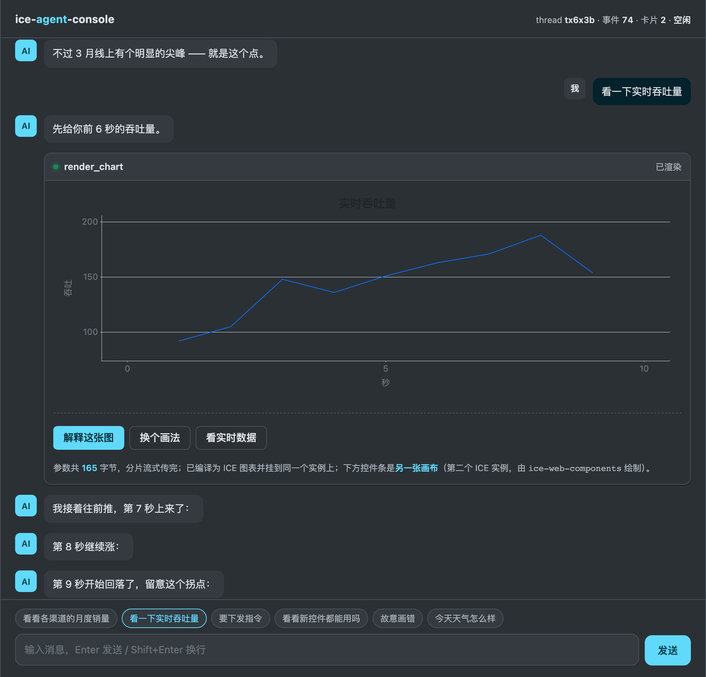

# ice-agent-console

把 **ICE 家族**接到 **AG-UI 协议**上：Agent 的事件流驱动 ICE 画布，图表与表单以卡片形式**内联在对话时间线里**。


一个最小可运行实例，**两种模式、一个接口**：

| 模式 | 什么时候用 | 后端是什么 |
|---|---|---|
| **剧本模式**（默认） | 不配任何东西就能跑。演示、录屏、e2e | `ScriptedAgent` —— 确定性的规则 agent |
| **模型模式** | 配上 token 之后 | `LlmAgent` —— 真模型决定画什么、问什么 |

两种模式产出的都是**同一串 AG-UI 事件**，所以传输层、前端归约器、渲染层完全分辨不出来，
也不需要分辨。换模型只动一个文件（`server/agents/llm.ts`）。

```
┌─────────────┐   POST /agui (RunAgentInput)   ┌──────────────────────┐
│  浏览器      │ ─────────────────────────────► │  AG-UI endpoint      │
│             │                                │  (node:http)         │
│  DOM thread │ ◄───── SSE 事件流 ──────────── │  ScriptedAgent /     │
│  + canvas   │                                │  LlmAgent            │
└─────────────┘                                └──────────────────────┘
   ICE 负责卡片里的图与表单                    ↑ OpenAI 兼容接口（可选）
```

---

## 1. 快速开始

前置：**四个**兄弟仓库要先构建过（工程不装它们的 npm 包，直接指向同级目录）。

```bash
# 在 ice-render/ 目录下
ls ice-render/dist/index.cjs ice-chart/dist/index.cjs ice-chart-dsl/dist/index.cjs \
   ice-web-components/dist/index.cjs ice-web-components-dsl/dist/index.cjs   # 都应在

cd ice-agent-console
npm install
npm run dev          # 同时起 AG-UI 后端(8099) 和前端 dev server(8100)
```

打开 http://localhost:8100 。**不配任何东西**就能用 —— 这时走的是内置剧本。

界面是暗色的（见 §3.5），下面那排快捷按钮各对应一条回路：

| 按钮 | 演示什么 | 截图 |
|---|---|---|
| 看看各渠道的月度销量 | 主链路：文字流式 → 参数流式拼装 → 上画布 → **指着 3 月讲** | 头图 |
| 要下发指令 | **人机回环**：中断 → 出表单卡 → 填完提交 → 带 `resume` 开新 run | [表单卡](docs/images/form-card.png) |
| 看看新控件都能用吗 | **控件原型页**：一张表单里放 10 个字段，覆盖 DSL 0.3.0 的 20 个字段类型 | [新控件](docs/images/showcase.png) |
| 看一下实时吞吐量 | `STATE_DELTA` → `appendData` 快路径，同一张图逐拍长数据 | [流式追加](docs/images/streaming.png) |
| 故意画错 | **自修复回路**：坏 DSL → 诊断回灌 → agent 自动吐修正版 | [自修复](docs/images/self-repair.png) |
| 今天天气怎么样 | 兜底：不画图，只回文字 | — |

**也可以在图上直接操作**：

- 点柱子、或框选一段区间 → 触发新一轮 run，你的操作作为结构化上下文上报
- 卡片底部那条**控件栏**（`ice-web-components` 画在另一张画布上）：
  「解释这张图」/「换个画法」/「看实时数据」 —— 同样走 AG-UI 上行

```bash
npm run serve        # 只跑静态产物（仍需后端在跑）
```

### 1.1 接自己的大模型

**只要接口兼容 OpenAI 的 `/chat/completions` 就行** —— 官方、DeepSeek、通义、本地的 ollama /
vLLM / LM Studio 都可以。填三行，重启：

```bash
cd ice-agent-console
cp .env.example .env
```

```ini
ICE_LLM_API_KEY=sk-你的token
ICE_LLM_BASE_URL=https://api.openai.com/v1     # 本地 ollama 是 http://localhost:11434/v1
ICE_LLM_MODEL=gpt-4o-mini
```

重启 `npm run dev`，看启动横幅：

```
[agui] agent     LlmAgent（真模型；节奏 26ms/字）
[config] 读到了 .env
[config] 模型   gpt-4o-mini
[config] 接口   https://api.openai.com/v1
[config] token  sk-a…mnop（56 位）
```

#### 全部配置项

| 变量 | 默认 | 说明 |
|---|---|---|
| `ICE_LLM_API_KEY` | 空 | **token**。留空就走剧本模式 |
| `ICE_LLM_BASE_URL` | `https://api.openai.com/v1` | **接口地址**，不含结尾斜杠（代码会拼 `/chat/completions`） |
| `ICE_LLM_MODEL` | `gpt-4o-mini` | 模型名。**要选支持 tool calling 的** —— 本工程靠工具调用决定画什么 |
| `ICE_LLM_TEMPERATURE` | `0.3` | 采样温度。要它稳定挑工具就调低 |
| `ICE_LLM_TIMEOUT_MS` | `60000` | 单次请求超时。本地小模型首字慢就调大 |
| `ICE_LLM_MODE` | `auto` | `auto` 有 key 就用模型 / `scripted` 永远走剧本 / `llm` 必须走模型 |
| `ICE_AGENT_PACE` | `26` | 播放节奏（毫秒/字）。`0` = 不等，e2e 用 |
| `ICE_AGENT_API_PORT` | `8099` | 后端端口（家族端口表登记过，一般不用改） |

几个刻意的取舍：

- **也认 `OPENAI_API_KEY` / `OPENAI_BASE_URL` / `OPENAI_MODEL`** —— 你本机已经有的话不用再抄一份。
- **`process.env` 优先于 `.env`**：容器里注入的变量不会被仓库里的一份文件顶掉。
- **显式写了 `ICE_LLM_MODE=llm` 却没给 token → 启动直接报错**，不会静默退回剧本。
  静默退回会让你以为配好了、实际一直在看假的。同理，**接口报错（401 / 404 / 超时）会原样抛到界面上**
  变成一条红色气泡，里面是接口的真实报错，不降级。
- **token 在日志里只打前后各 4 位** —— 启动日志经常被贴到 issue 里。
- `.env` 已进 `.gitignore`，只有 `.env.example` 进版本库。

#### 配完先跑自检

配大模型最容易卡住的不是代码，是那三行配置：token 打错一位、地址少了 `/v1`、
模型名不存在、接口不支持 tool calling……这些在界面上看起来都只是"没反应"。所以有一条命令：

```bash
npm run llm:check
```

```
ice-agent-console · 大模型配置自检

  接口   https://api.openai.com/v1
  模型   gpt-4o-mini
  token  sk-a…mnop（56 位）

✓ 接口通了，模型回了："收到"
✓ 模型会调工具：render_chart，参数解析成功
✓ 认得出图表类型：kind = bar

✓ 配置可用。跑 npm run dev，然后把刚才那句问一遍试试。
```

它会打两次请求：一次最小的（验连通性 / token / 模型名），一次**带工具的**
（验这个模型会不会用 tool calling —— 这一条是本工程能不能用的关键，
而很多接口的报错信息在这件事上很含糊）。失败时会把错误翻译成能直接动手改的一句话。

### 1.2 模型模式下它会怎么做

工具一共三个，都在 `server/agents/tools.ts`：

| 工具 | 干什么 |
|---|---|
| `render_chart` | 把数据画成图表卡 |
| `collect_input` | **渲染成可填的表单，并让这一轮停下来等提交** —— 在协议里这就是一次中断 |
| `point_at` | 画完之后指着某个数据点讲（`xValue` 必须是刚画那张图的 x 刻度之一） |

一次 run 里**调两次模型**：第一次让它选工具；把工具结果回灌之后再调第二次，拿"画完之后的那句话"。
这是为了对齐剧本里的卡片形态（`先说一句 → 卡片 → 再讲一句`），也是真实 agent 循环的形状。

> **工具 schema 故意写得不等穷尽。** 表单 DSL 的完整约束有 38 个错误码，
> 全塞进 schema 既贵又没用 —— 值语义（"默认值必须在 options 里"）本来就不是 JSON Schema 能表达的。
> 所以这里只写结构骨架，值语义交给下游：客户端的 `validateFormDsl` 校验，
> 不通过就把**带"可用取值"的结构化诊断**经 `context` 回灌，下一轮模型自己改。
> 那条自修复回路本来就在（§2.6），**剧本模式与模型模式共用它** ——
> 剧本是"故意写错"，模型是"真的写错"，回路的代码一行不差。

> **文本不是真 token 流。** 事件序列是一份纯函数（`dsl-to-events.ts` 的 `planToEvents`），
> 真流式意味着要再写一份"边收边发"的实现，两份必然漂。所以这里是拿到完整回复后
> 按节奏分片播 —— 观感上"它在逐字打"是一样的，区别只在开始打之前多等一次网络往返。

---

## 2. 它演示了什么

四条回路，都是这个工程存在的理由：



### 2.1 单向：事件流驱动画布

`TOOL_CALL_ARGS` 是**分片流式**的，所以卡片里能看到图表 DSL 一个字一个字拼出来——
而不是像多数工具调用界面那样只能转个圈。拼完 → `validateChartDsl` → `compileChartDsl`
→ 挂到画布上。

### 2.2 单向：Agent 指着图讲

`showHoverAtValue(x)` 让 Agent 能在解说过程中把高亮点移到某处。
事件流是**有序**的，所以文字 delta 和画布指令在时间上交错到达——
用户读到哪里，图就指到哪里。这是 ICE 在这条链路上最不可替代的能力。

### 2.3 双向：用户在图上的操作回到 agent

三个来源，走**同一条** `context` 通道：

| 来源 | 事件 | 来自哪块画布 |
|---|---|---|
| 点数据点 | `item:click` | 图表层 |
| 框选区间 | `brush:end` | 图表层 |
| 点控件按钮 | 控件自己的 `click` | **控件层（第二块画布）** |

它们都作为**结构化上下文**塞进下一轮 run 的 `context` 字段，而不是拼进用户说的话里。
分开的意义：agent 分得清哪部分是"用户做的"、哪部分是"用户说的"。

接上模型之后，提示词里可以给"用户动作"一个明确的地位。

### 2.4 双向：`state` 让 agent 知道"现在画面上是什么"

`context` 只能告诉 agent **用户做了什么**；要让 agent 知道**现在画面上是什么**，
得靠协议的 `state` 字段 —— 客户端把当前的图表定义放在 `state.chart` 里回传。

控件条上的「解释这张图」和「换个画法」就是读它：
前者逐项说出当前图表的类型/列/编码，后者**只换 `kind`、数据一行不动**重新画一张。
agent 不需要你复述"刚才画的是什么"。

### 2.5 双向：人机回环（中断 → 填表 → resume）

Agent 缺参数时**不是反问一句**，而是走协议的中断：

```
RUN_FINISHED { outcome: { type: 'interrupt', interrupts: [{ id, reason, message }] } }
```

前端据此进入 `waiting`（不是 `idle` —— 用户还没答），并把 `collect_input` 那张 tool call
渲染成**表单卡**。用户填完点提交：

```
新一轮 run 的 RunAgentInput.resume = [{ interruptId, status: 'resolved', payload: values }]
```

要点（这几条不是自定的，是从 `@ag-ui/core` 的 schema 问出来的）：

| 协议事实 | 含义 |
|---|---|
| 中断**也是** `RUN_FINISHED` | "run 结束了"与"还留着一个待答复的口子"不矛盾 |
| `interrupt` 形状 `{ id, reason, message? }` | `id` / `reason` 必填，数组非空 |
| 恢复 = **开新 run** + `resume` | 不是"接着跑"，所以前端要带上答案重发 |
| `status: 'resolved' \| 'cancelled'` | 只有两个取值 |

表单本身由 `ice-web-components-dsl` 渲染 —— agent 只声明"要问什么"：


**这是目前唯一一处"Agent 不只是说话，而是要用户做一件事"的能力。**
接上模型之后它同样成立：模型调 `collect_input` 就等于宣告"我需要用户提供信息"。

### 2.6 双向：诊断回灌的自修复

`ice-chart-dsl` 的 `validateChartDsl` **任何输入都不抛异常**，它的设计目的就是
"给 agent 做自修复用的反馈通道"——诊断里带可用列名、表达式字符位置。

这条回路把它用起来：坏 DSL → 客户端校验拦下 → 诊断走 `context` 回灌 →
agent 吐修正版 → 画出来。**全程自动，用户不用再说话。**


脚本化阶段就把这条回路走通，意义在于接真模型时回路上的每一段都已经测过了。
那时候唯一的变量只剩"模型这次吐的对不对"——而这个定位能力在 LLM 应用里最值钱，
因为平时你分不清是模型的问题还是管道的问题。**所以模型模式直接复用了同一条回路。**

---

## 3. 架构

### 3.1 三层

| 层 | 位置 | 职责 |
|---|---|---|
| 协议层 | `server/`、`src/domain/agui/` | AG-UI 事件的编解码、归约 |
| 翻译层 | `server/agents/dsl-to-events.ts`、`src/domain/ice/` | "想画什么" ↔ "事件序列" ↔ "ICE 调用" |
| 渲染层 | `src/view/` | DOM thread 外壳 + 卡片里的 canvas 层 |

### 3.2 一个刻意的分界：DOM 外壳 + canvas 内容

`ice-web-components` 的立场是 "every pixel drawn by the engine"，但它适合的是
应用外壳、表单、弹窗这类自成一体的画布界面。Thread 式消息流不行：
消息要能选中复制、要能走输入法、要有浏览器原生的滚动惯性、要能被屏幕阅读器读。

所以**DOM 管 thread 外壳（消息列表/滚动/输入框/卡片容器），canvas 管卡片内容**。
这个工程不是纯 canvas 应用，这是有意为之。

### 3.3 卡片按 tool 名分派：一次 tool call 一种形态

`CardView` 按工具名分派，**加一种卡片只是加一个工具名** —— 归约器与时间线完全不用动：

| 工具名 | 卡片形态 | 画布 |
|---|---|---|
| `render_chart` | 图表卡 | `.chart-wrap` + `.widget-wrap`（两块，两个 ICE 实例） |
| `collect_input` | **表单卡** | `.form-wrap`（一块，由 `ice-web-components-dsl` 渲染）。DSL 0.3.0 起支持 **20 个字段类型** |

三者**互斥**（一次 tool call 只有一种形态），但卡片骨架在构造时就一并建好了容器，
靠 `hidden` 切换。所以 e2e 要按**可见性**断言，不能数 canvas 的个数。

一张图表卡片里有两个独立的 ICE 实例：

```
┌─ 图表卡 ───────────────────────────────┐
│ .chart-wrap  <canvas>                   │  ← ICE 实例 ①（ice-chart 自己 new 的）
│ .widget-wrap <canvas>                   │  ← ICE 实例 ②（ice-web-components 的控件条）
└─────────────────────────────────────────┘
┌─ 表单卡 ───────────────────────────────┐
│ .form-wrap   <canvas>                   │  ← ICE 实例③（ice-web-components-dsl）
└─────────────────────────────────────────┘
```

为什么要两块而不是一块：**引擎的模型是「一层 = 一个 ICE 实例 + 一张 canvas」**，
而 `ice-chart` 内部自己 `new ICE()`、不接受外部实例（见 `docs/upstream-gaps.md` 第 7 条）。
硬塞只能走 `addMark`，但那个槽位是**按数据坐标**摆位的（适合"锚在异常点上的浮动按钮"），
不适合"卡片底部一条控件栏"。两种需求，两个层。

分工的判据是"这东西该跟着数据坐标走，还是该跟着卡片布局走"：

| 放哪 | 什么进这里 |
|---|---|
| 图表层（`addMark`） | 与数据绑定的东西：阈值线、异常点标记、锚在某个点上的小按钮 |
| 控件层（第二块画布） | 卡片级的控件：一排动作按钮、图表类型切换 |
| DOM 外壳 | 消息、输入框、滚动 —— 需要可访问性与输入法的东西 |

**层之间是并排关系，不是叠加**，所以不需要 `linkViewport` / `setInputPassthrough` /
`composeLayersToCanvas` —— 那些只在层与层重叠时才有意义。
`src/domain/ice/layer.ts` 因此只有"尺寸转交 + 一起销毁"两件事，**故意没做成大抽象**。

控件条用 canvas 画而不是 DOM `<button>`，代价要说清楚：**canvas 控件没有 DOM 的可访问性、
输入法、Cmd+F**。这里选它是因为要试的正是"canvas 控件层能不能跟图表共存"，
顺带拿到同一套主题。聊天区那部分仍然是真 DOM —— 分界线没变。

### 3.4 纯核心 + 命令式外壳

`src/domain/agui/reducer.ts` 是**纯函数**，返回 `{state, effects}`：
它只描述"要做什么"，不碰 DOM。碰 canvas 的活在 `src/entries/boot.ts` 的 `applyEffects` 里。

这样归约器可以被穷举测试（连"边画边指"的事件顺序都能断言），而 canvas 脏活留在需要它的地方。

### 3.5 主题：画布与外壳读同一份 token

界面是**两半拼起来的**（§3.2），所以"做成暗色"要同时动两处 —— 而两处各维护一套颜色必然会漂。
第一版就是那样：画布里的控件是 Bootstrap 深灰、外壳是另一套蓝，拼在一起像两个应用。

现在只有**一份 token 表**（`ice-web-components` 的 `ICEThemeTokens`），`src/domain/theme.ts` 负责分发：

| 谁 | 怎么拿到颜色 |
|---|---|
| 画布里的**控件** | `iceUIManager.setTheme()` —— 库的主题是"组件构造时读一次"，所以在 boot 时定死 |
| 画布里的**引擎外壳**（选中框 / 手柄 / 阴影色） | `applyThemeToEngine(ice)` —— 引擎主题是**实例级**的，卡片里那三块画布各调一次 |
| 画布里的**图表** | 不用单独调：`ICEChart` 的 `theme: 'auto'` 按**引擎主题背景色的亮度**判明暗 |
| **DOM 外壳** | `applyThemeToCss()` 把同一张表写进 CSS 变量，样式表里只引用 `var(--…)` |

不直接用库内置的 `dark`：它是 Bootstrap 中性灰基调（主色 `#0d6efd`），
而 ICE 家族的品牌色是冰蓝 `#61D9FB`。所以在它之上打了一层补丁，把 primary 一族换成冰蓝 ——
深底上冰蓝比 Bootstrap 蓝亮得多，也更像"同一个产品"。

**没做成运行时切换的开关**，不是因为懒：库的主题在组件构造时读一次，热切换要重建所有卡片里的
组件树，而卡片里还跑着 rAF、事件监听与流式更新。要做的话正确的做法是重建整条 thread，
等真有人要切换时再做。

---

## 4. 协议 → ICE 的映射表

**这张表是这个工程的全部价值**，剩下的都是管道。

| AG-UI 事件 | ICE 侧动作 | 备注 |
|---|---|---|
| `RUN_STARTED` / `RUN_FINISHED` / `RUN_ERROR` | 状态机 | |
| `TEXT_MESSAGE_*` | 纯 DOM 气泡 | 这层不需要 ICE |
| `TOOL_CALL_START/ARGS/END` | 卡片：参数流式拼装 → 解析成 DSL | `ARGS` 分片可见 |
| `TOOL_CALL_RESULT` | 卡片进入终态 | |
| `STATE_SNAPSHOT` | `compileChartDsl` → `setOption`（**同一实例**） | 快照是替换语义 |
| `STATE_DELTA` | JSON Patch → 纯追加走 `appendData`，否则全量 `setOption` | 见 §5.2 |
| `CUSTOM: ice/point-at` | `showHoverAtValue(x)` | 指着讲 |
| 上行 `item:click` | → 新 run，`context` 带结构化交互 | 见 §2.3 |
| 上行 `brush:end` | → 新 run，`context` 带选区 | 同上 |
| 上行 控件按钮 click | → 新 run，`context` 带 `widget-action` | 来自**第二块画布** |
| 下行 **读** `RunAgentInput.state` | agent 据此知道当前图表是什么 | 见 §2.4 |
| `RUN_FINISHED` + `outcome.interrupt` | 状态进 `waiting`；卡片渲染成**表单** | 见 §2.5 |
| 上行 `RunAgentInput.resume` | 用户提交表单 → 带答案开新 run | 协议原生通道 |

### 4.1 事件顺序：先画后讲

```
RUN_STARTED
[intro]              一句话说明要干什么
TOOL_CALL_START ─ ARGS×n ─ END     参数流式分片
TOOL_CALL_RESULT
STATE_SNAPSHOT                     画布真相
[beats]              画完之后的解说（可插 CUSTOM 指点 / STATE_DELTA 追加）
RUN_FINISHED
```

**为什么不是"边说边画"**：`CUSTOM` 指点的对象是画布，画布得先在。
第一版把解说全排在 tool call 前面，结果指点事件到达时图上什么都没有——
前端只能缓冲，而缓冲意味着"指着讲"和文字不再同步，整个演示效果就没了。
`tests/dsl-to-events.test.ts` 里有一条测试专门盯这个顺序。

---

## 5. 三处必须知道的 ICE 侧约束

### 5.1 不要用 `renderChartDsl`

它内部每次都 `createChart`。用在流式更新上会不停泄漏图表实例，
而且挂在上面的交互监听会随之丢失——症状是"更新几次之后点了没反应"，
只在第 N 次更新后才出现。

本工程拆成 `validateChartDsl → compileChartDsl → createChart / setOption`，实例只建一次。

### 5.2 `appendData` 只能用在数值/时间轴

它只往 `series.data` 末尾 `concat`，**不碰 `xAxis.data`**。

- 数值轴：`series.data = [[x, y], ...]` → 适用
- 类目轴：`xAxis.data = ['1月', ...]` + `series.data = [120, ...]` → 往这类轴追加**新类目**会错位

所以 `planAppend`（`src/domain/ice/option-mapping.ts`）认出类目轴就返回 `null`，
调用方退回全量重绘。慢一点但一定对——判错不会当场报错，只会在某个时刻以
"图怎么不对"的形式浮现，那种 bug 最难查。

"实时吞吐量"那个剧本因此用数值轴（秒）而不是类目轴（月份）。
这不是为了演示好看，是 `appendData` 的注释里写明的"实时数据流专用"场景。

### 5.3 宽度要自己传、自己再传下去

**画布尺寸**用引擎的 `ICE.fitCanvasToDisplaySize(cssW, cssH)`（`2.12.0` 起），
它就是"backing store = 逻辑尺寸 × dpr、CSS 尺寸固定为逻辑尺寸、顺手同步命中矩形与内容盒"
这一份契约的唯一实现。本工程的 `Layer.fit()` 是它的一行包装。

**内容宽度是另一件事**，引擎管不了：宽度在 ICE 里是每个组件自己的属性，
**没有"父级拉满"的自动传导**（细节见 `ice-web-components-dsl/README.md` §8.1）。
所以卡片要把自己的可用宽度一路传下去，并且容器尺寸变了要**再传一次**：

```ts
// 建的时候
this.result = renderFormDsl(canvas, dsl, { width: cssWidth });
// 尺寸变了：resize 管画布，setWidth 管内容，两个都要调
fit(cssWidth: number) {
  this.result.setWidth(cssWidth);
  this.result.resize(cssWidth, height);
}
```

漏掉 `setWidth` 的症状是"窗口变宽了、画布也宽了，但表单还是原来那么宽"——
不会报错，只是难看得莫名其妙。

> 这里**故意不传 `maxWidth`**：DSL 默认会把内容夹到 640，卡片 896 宽时表单就排 640、
> 左边对齐 —— 一行 896 宽的输入框没人读得过来。传 `maxWidth: Infinity` 就会铺满整张卡片，
> e2e 里有一例专门守着这条（"不缩成一小块，也不拉满整张卡片"）。

> 这条是本工程实测逼出来的：修复前宿主 896 宽时表单只在左边画了 229px，
> **右边空掉 667px（74%）**；而且 `countInk` 那类"画了没有"的断言抓不到它 ——
> 着墨量照样几千。所以 e2e 里加了按**着墨包围盒**判排布的用例（见 §9）。

> 顺带在这个过程里逼出一个**真缺陷**并已修（`ice-render` 2.12.1）：
> `fitCanvasToDisplaySize()` 改完尺寸不置脏，空闲停帧状态下 resize 会**静默白屏**。
> 见 `docs/upstream-gaps.md` 第 9 条。

---

## 6. 明确不做的

范围边界，写下来免得被当成遗漏：

1. **模型模式下不做多轮工具循环。** 固定两圈（选工具 → 给结论），见 §10 末尾。
   要"先查数据再画"得让它循环，那是下一步。
2. **不做 mark 拖动改历史。** `addMark` + `mark:drag` 是 ICE 独有的能力，但它属于
   **就地改历史**，跟 Thread"消息发出即定"的语义冲突。真要做得改设计
   （建议方向：拖动不写回原卡片，而是追加一条新消息触发新 run）。
3. **不做历史卡片冻结。** 目前所有卡片都是活的。往上滚的旧卡片仍可交互——
   这在卡片少的时候没问题，卡片多了需要一个"只有最新一张是活的"策略。
4. **不做 thread 持久化。** 刷新即清空。`threadId` 已经按协议在用，但没存。
5. **不做 reasoning / subagent / activity 事件。** 协议里有，本工程没用。
   归约器对未知事件是丢弃语义，所以它们不会导致崩溃，只是不显示。
6. **不做多中断并发。** 协议允许 `RUN_FINISHED` 一次带多个 `interrupts`，
   本工程一次只处理一个（取第一个）。多中断需要给每张表单卡各自绑定 interruptId ——
   归约器已经按数组收了，缺的是卡片与 interruptId 的关联。

---

## 7. 目录结构

```
ice-agent-console/
├── server/                  AG-UI endpoint（原生 node:http，运行时只依赖 @ag-ui/core）
│   ├── index.ts             路由、SSE、错误处理、取消、选 agent
│   ├── config.ts            .env + 环境变量 → 两种模式的判定（含 token 脱敏）
│   ├── protocol.ts          SSE 帧编码
│   └── agents/
│       ├── types.ts         AgentRun 接口 ← M1/M2 的分界线
│       ├── dsl-to-events.ts 计划 → 事件序列 ← 两种模式共享
│       ├── scripted.ts      剧本模式：确定性 agent + 播放节奏
│       ├── scenarios.ts     剧本模式：关键词 → 计划
│       ├── llm.ts           模型模式：LlmAgent（自然语言 → 计划）
│       ├── llm-client.ts    模型模式：/chat/completions 客户端（fetch，无 SDK）
│       └── tools.ts         模型模式：tool 定义 + 系统提示词
├── src/
│   ├── domain/              纯逻辑，无 DOM
│   │   ├── agui/            SSE 解析 / 归约器 / JSON Patch
│   │   ├── ice/             协议 → ICE 的纯翻译 + Layer/LayerSet（层）
│   │   └── theme.ts         主题：一份 token 分发给画布与 DOM
│   ├── view/                DOM 外壳 + canvas 层
│   │   ├── chart-adapter.ts 图表层（ICE 实例 ①）
│   │   ├── widget-layer.ts  控件层（ICE 实例 ②，ice-web-components 画）
│   │   ├── form-layer.ts    表单层（表单卡唯一那块画布，ice-web-components-dsl 画）
│   │   ├── card.ts          卡片：按 tool 名分派出图表 / 表单
│   │   └── thread.ts        thread 外壳
│   └── entries/boot.ts      接线：分发动作、执行 effects、触发 run
├── shared/contract.ts       自定义事件名 / context 键（server 与 web 的唯一出处）
├── public/index.html        页面骨架 + 样式（颜色全走 CSS 变量，见 §3.5）
├── scripts/
│   ├── dev.mjs              一条命令起两个进程
│   ├── llm-check.ts         npm run llm:check —— 配完模型先跑这个
│   └── shoot-docs.cjs       npm run shoot —— 重拍 README 里的截图
├── tests/  e2e/             jest 单测 + playwright
├── docs/images/             README 里的截图（2× 采集，按内容盒裁切）
└── docs/upstream-gaps.md    对上游的观察
```

---

## 8. 工程约定

### 8.1 家族包怎么解析（三处，都不用 `file:`）

| 用途 | 机制 |
|---|---|
| 运行时打包 | webpack `resolve.alias` → 同级仓库目录（5 个：引擎 / 图表 / chart-dsl / 控件库 / 表单 DSL） |
| 类型检查 | tsconfig `paths` → 同级仓库目录 |
| 单测 | jest `moduleNameMapper` → 同级仓库的 `dist/index.cjs` |

`node_modules` 里不塞任何家族包。理由与代价见 `docs/upstream-gaps.md` 第 6 条。

**alias 是为了强制单实例**：各包的 `node_modules` 里可能躺着版本不同的 `ice-render` 副本，
解析出多份引擎会让 `typeId` 注册表错位（`ice-chart` 造出来的图元在引擎眼里不是"同一个 ICE 的组件"）。

### 8.2 双 tsconfig

- `tsconfig.json`（web + tests + e2e）：DOM lib
- `tsconfig.server.json`（server + shared）：**故意不加载 DOM lib**

后者不是形式主义：它让 `document` / `window` 在 server 代码里**直接编译失败**。
agent 后端跑在 Node 里，误用浏览器 API 只会在运行时炸，而且往往只在某个分支上
（比如只在出错路径里用了 `document`）。

### 8.3 端口

**8099**（AG-UI 后端） / **8100**（页面）—— 两个号是因为本仓有两个服务。

家族端口一仓一个，**权威表在 `ice-render/AGENTS.md`**（引擎 8090 / 实体设计器 8091 /
smart-water 8092 / web-components 8093 / render-dsl 8094 / react-demo 8095 /
chart-dsl 8096 / entity-designer-dsl 8097 / game 8098 / 本仓 8099+8100 / web-components-dsl 8101）。
新增服务**先在那张表里登记再写进配置** —— 那条规矩是有代价换来的：表下面记着一次真实事故，
某仓私自用了 8093，而 `ice-web-components` 的 playwright 也是 8093 且
`reuseExistingServer: true`，于是它的 e2e 静默复用了别人的服务目录、9 个用例全红，
排查很久才发现是端口串号。

`reuseExistingServer` 在本仓一律 `false`：端口被占时**响亮失败**，不要静默复用。

### 8.4 不用 dev-server 反向代理

前端**直连** `http://localhost:8099/agui`，后端开 CORS。
SSE 经中间层容易被缓冲，出问题时很难判断是协议问题还是代理问题。

---

## 9. 验证

```bash
npm run verify        # types:check(两个 tsconfig) + jest + build
npm run verify:full   # 上面 + playwright
npm run llm:check     # 模型配置自检（不懂模型也能跑：没配就报"当前是剧本模式"）
npm run shoot         # 重拍 docs/images 里的截图（需先 npm run dev）
```

**模型路径不填 token 也能测**：`tests/llm-agent.test.ts` 会起一个**真的 http 服务**冒充
OpenAI 兼容接口（随机端口），让 `LlmAgent` 真去调它。之所以不 mock `fetch`：
要验的正是"配上一个接口就能用"，而那包括 URL 拼接、请求头、请求体形状、响应解析、
两次调用的循环 —— mock 掉 `fetch` 会把最容易错的那部分一起 mock 掉。

    ✓ 两轮：先选工具、再给结论；URL / 头 / 体都拼对了
    ✓ 表单：调 collect_input → RUN_FINISHED 带 interrupt（前端进 waiting）
    ✓ 模型直接回一句话（没调工具）→ 只有文字，没有卡片
    ✓ 把诊断与画布交互翻译进提示词（自修复回路与追问都靠它）
    ✓ 接口报错时原样抛出去（不悄悄退回剧本）

当前规模：

| 项 | 数字 |
|---|---|
| 单测 | **140 passed** / 9 suites |
| e2e | **24 passed** / 7 specs |
| 生产包 | 约 1.1 MiB（引擎 / 图表 / 控件库 / DSL 四个兄弟仓的产物 + 应用自己那点） |

> 控件库（`ice-web-components`）一进来就占掉 488 KiB —— 是反着用的代价：
> 它是个 84 个组件的完整工具集，这里只用到了 `ICEButton`。
> 真要瘦身得走 tree-shaking（它目前的产物是 UMD 单文件，摇不掉）。

e2e 的判据**不是"DOM 里有没有 canvas"**——canvas 元素存在但全白是很典型的一种失败。
用例一律数**非透明像素**，并断言画布内容在某些事件前后**确实变了**（比如"指着讲"）。

但"有墨"还不够：`countInk > 3000` 对"表单只占左边一小块、右边空 74%"照样成立。
所以表单那两例量的是**着墨包围盒**（`inkBounds()`）—— 按**排布**判，而不是按"画了没有"判。
这一组是被实测缺陷逼出来的，见 §5.3。

另外每条用例都收集 console / pageerror / 网络错误，要求为空。

---

## 10. M2：模型接在哪（已经接了）

这个工程一开始是按"接口先定、实现后补"做的：`AgentRun` 就是那条分界线，
`ScriptedAgent` 先占着位置。**接模型时那条分界线纹丝不动** —— 新增的全部代码是
`server/agents/` 下的四个文件，`dsl-to-events.ts` 一行没改：

```
剧本:  用户消息 → (关键词规则) ─┐
                                ├→ ToolCardPlan → [DSL → 分片成 TOOL_CALL_ARGS + 文本叙述 → 事件序列]
模型:  用户消息 → (大模型)     ─┘
```

换实现只动一行：

```ts
// server/index.ts
const agent: AgentRun =
  config.mode === 'llm' && config.llm ? new LlmAgent(config.llm, pace) : new ScriptedAgent(pace);
```

三条输入通道在剧本阶段就已经全部打通，所以接模型时**管道一行没动** ——
提示词里把这三条讲清楚就行：

| 通道 | 模型模式怎么用它 |
|---|---|
| `context` | 两条扩展通道分开翻译：渲染端**诊断**（触发自修复）+ 用户**在画布上的动作**（触发追问） |
| `state` | 作为一条"当前画布状态"的消息喂进去，它才能做"换个画法"这类事 |
| `resume` | 上一轮中断的答复。模型据此知道"我问的那些，用户填了什么" |

**还没做的（真要上生产要补的）**：

- **真 token 流**（见 §1.2 的说明：现在是一份纯函数事件序列，不做第二份流式实现）
- **多轮工具调用**：现在固定两圈（选工具 → 给结论）。要"先查一次数据再画"就得让它循环
- **真实数据源**：模型现在只能拿到对话里已有的数字，没有接数据库/接口的工具。
  这也意味着它**只能说对话里出现过的数** —— 有工具之后才谈得上"去查一下"
- **鉴权**：这个 endpoint 是裸的（本地演示）。上线要加 token 校验与按用户限流
- **`resume` 之后的续跑**：现在答复完是开一个**新** run（协议如此），
  但如果模型想说"好，那我按这些参数继续下发"，需要一个"继续执行"的工具

--- 

## 11. 上游缺口

见 [`docs/upstream-gaps.md`](docs/upstream-gaps.md)。

一句话结论：**这个工程全程没有改过任何一个上游仓库**。作为一次对 ICE 家族对外接口的
真实集成测试，结果是接口够用——三条"绕过"都是"选择不那样用"，而不是"缺东西"。
唯一一条真正的请求是 `ChartEventName` 缺 `mark:drag` / `mark:dragend`
（类型层面的补全，不影响运行时）。

---

## 12. 许可

MIT
